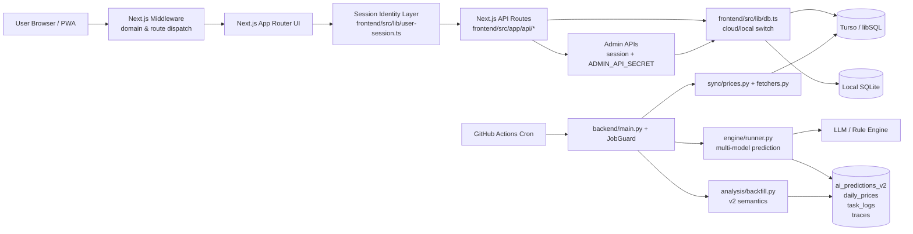
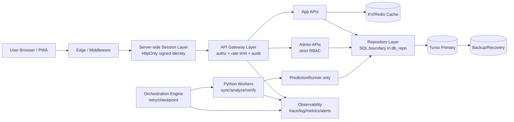

# StockWise 架构文档（生产基线与演进方案）

> **更新时间**: 2026-02-23
> **版本**: v3.1（P0 完成基线版）
> **适用范围**: `frontend/`、`backend/`、`docs/` 当前仓库实现

## 1. 文档目标与边界

本文件用于回答四个问题：
1. 当前系统真实是如何工作的（事实基线）。
2. 当前架构的主要生产风险是什么（按严重级别排序）。
3. 目标架构要达到什么状态（可验证、可运营、可审计）。
4. 如何分阶段落地（30/60/90 天可执行路线图）。

不在本文件内展开的内容：
- 具体产品功能说明（见产品文档）。
- 单个模块的实现细节（见源码与模块内 README）。

---

## 2. 当前架构事实基线（As-Is）

### 2.1 系统拓扑

- 前端：Next.js 15.5.9（App Router）运行于 Vercel。
- 数据库：Turso（云）+ SQLite（本地 fallback）。
- 后端批处理：Python CLI（`backend/main.py`）由 GitHub Actions 定时触发。
- AI 推理：多模型路由主链路为 `backend/engine/runner.py`，并存部分历史兼容逻辑。

### 2.2 前端架构现状

#### 2.2.1 框架与运行时
- 栈：Next.js 15.5.9、React 19、Tailwind v4。
- 路由与域名策略：`frontend/src/middleware.ts`。
  - `app.ziso.cc` 与主域名流量分流。
  - `/v/[code]` 通过 307 重定向注入邀请码参数。

#### 2.2.2 数据访问
- 统一入口：`frontend/src/lib/db.ts`。
  - 云模式：`@libsql/client`。
  - 本地模式：`better-sqlite3`。
  - 包含 `executeWithRetry` 的瞬态错误重试逻辑。

#### 2.2.3 鉴权与身份现状
- `frontend/src/app/(dashboard)/dashboard/layout.tsx` 使用本地缓存（`AUTH_CACHE_KEY`）提升首屏体验与离线可用性。
- 已落地服务端会话身份层：`frontend/src/lib/user-session.ts`（`HttpOnly` 签名 Cookie）。
- 业务 API 已统一改为 `requireUserSession(request)` 获取可信 `userId`，不再信任客户端 `userId` / `x-user-id`。
- 当前仅保留迁移开关 `ALLOW_LEGACY_USERID_BOOTSTRAP`（`/api/user/register` 兼容路径），用于旧客户端平滑迁移。

#### 2.2.4 API 层现状
- API 路由集中于 `frontend/src/app/api/*`。
- `internal/notify` 已有 `Authorization: Bearer <INTERNAL_API_SECRET>` 校验。
- `admin/*` 已接入统一管理员会话鉴权与 API 密钥鉴权（登录会话 + `ADMIN_API_SECRET` 双通道）。
- `api/admin/*` 已完成 SQL 参数化改造，移除字符串拼接查询。

### 2.3 后端架构现状

#### 2.3.1 作业编排
- 入口：`backend/main.py`。
- 任务护栏与落库：`backend/job_guard.py` + `task_logs`。
- 调度方式：GitHub Actions 定时触发，CLI 参数分发任务（同步、分析、验证、回填）。

#### 2.3.2 数据同步链路
- 行情同步：`backend/sync/prices.py`。
- 数据源聚合与降级：`backend/fetchers.py`（AkShare + fallback）。
- 当前周/月线更新是“清理 + 写入”分两次请求，存在锁冲突重试场景。

#### 2.3.3 AI 推理链路
- 主链路（多模型）：`backend/engine/runner.py` -> `ai_predictions_v2`。
- 旧表 `ai_predictions` 新写入已冻结。
- 回填链路已迁移到 v2 语义，`ai_predictions_v2` 为唯一生产写入目标。

### 2.4 数据架构现状

核心表（见 `backend/database.py`）：
- 行情：`daily_prices`、`weekly_prices`、`monthly_prices`
- 预测：`ai_predictions_v2`、`prediction_models`
- 追踪：`chain_execution_traces`、`llm_traces`
- 调度：`task_logs`
- 用户域：`users`、`user_watchlist`、`notification_logs` 等

### 2.5 可观测性现状

- 已有：任务级日志（`task_logs`）、预测追踪表（`chain_execution_traces`、`llm_traces`）。
- 未完善：统一 SLI/SLO、告警门槛、恢复演练标准、跨链路 trace 贯通。

### 2.6 当前架构图（As-Is）

---

## 3. 关键风险评估（按严重级别）

### 3.1 High：身份收口仍有迁移兼容窗口（残余风险）

**事实**
- 业务 API 主链路已使用服务端会话身份，客户端 `userId`/`x-user-id` 信任路径已移除。
- `api/user/register` 仍保留 `ALLOW_LEGACY_USERID_BOOTSTRAP` 兼容开关。

**影响**
- 在迁移窗口期，如开关配置不当会引入额外身份绑定复杂度。

**目标状态**
- 生产将 `ALLOW_LEGACY_USERID_BOOTSTRAP=false`，并在下一版本移除兼容分支代码。

### 3.2 Medium：管理面安全基线已建立，仍需运营侧固化

**事实**
- `api/admin/*` 已接入统一鉴权（管理员会话 + API 密钥）与 SQL 参数化。

**影响**
- 主要风险从“代码漏洞”转为“运维配置”与“密钥轮换”执行质量。

**目标状态**
- 固化密钥轮换、最小权限和审计复核节奏。

### 3.3 Medium：预测链路主事实源已统一，仍有历史兼容债务

**事实**
- 旧表 `ai_predictions` 已冻结新写入。
- 生产写入与回填已迁移到 `ai_predictions_v2`。

**影响**
- 主要剩余影响是代码可维护性与历史兼容路径清理成本。

**目标状态**
- 下线旧表相关兼容分支与脚本，完成只读归档。

### 3.4 High：SQL 治理与文档目标不一致

**事实**
- SQL 未完全收敛在 `db_repo/queries.py`。

**影响**
- 审计、索引优化、安全治理成本高。

**目标状态**
- 建立 SQL 目录边界与 CI 规则，业务层统一 repository 访问。

### 3.5 High：同步写入原子性不足导致锁冲突

**事实**
- 周/月线同步中，删除与写入分离请求，依赖重试掩盖冲突。

**影响**
- 高并发时延抖动、失败率上升。

**目标状态**
- 使用 Turso Pipeline 事务化提交（同一批次内完成 delete+insert）。

### 3.6 Medium：调度体系缺少可恢复编排能力

**事实**
- 依赖 GitHub Actions 周期触发，失败后粒度恢复能力有限。

**影响**
- 上游源抖动时恢复慢，重跑成本高。

**目标状态**
- 引入可断点、可重试、可追踪的编排层（或等价机制）。

### 3.7 Medium：架构文档缺少运营型指标

**事实**
- 当前文档缺 SLO/RTO/RPO 与发布回滚标准。

**影响**
- 无法把“架构目标”转化为“可验收结果”。

**目标状态**
- 建立可量化 SLI/SLO 与应急流程。

---

## 4. 目标架构（To-Be）

### 4.1 身份与访问控制

- 采用服务端签名会话（HttpOnly + Secure + SameSite + TTL + Refresh）。
- API 从会话读取 `user_id`，禁止业务接口信任 body/query/header 的身份字段。
- 匿名用户采用受签名临时身份，并设置过期与迁移策略。

### 4.2 API 安全基线

- `api/admin/*`：管理员鉴权 + 审计日志 + 最小权限。
- `api/internal/*`：保留内部密钥校验并增加来源限制（IP/网关策略）。
- 所有 SQL 语句参数化，禁止字符串拼接。

### 4.3 AI 数据链路统一

- `PredictionRunner` 作为唯一写入入口。
- `ai_predictions_v2` 作为唯一事实源。
- 回填、验证、报表统一到 v2 语义。

### 4.4 数据访问治理

- 仅允许 `db_repo` 与 `migrations` 持有原生 SQL。
- 业务服务通过 repository 调用。
- CI 增加 SQL 使用位置与参数化检查。

### 4.5 同步与编排

- 对周/月线更新采用 Pipeline 事务化写入。
- 对外部数据源设置分层降级和统一熔断策略。
- 引入可恢复编排能力（任务级重试、断点恢复、失败归档）。

### 4.6 缓存与性能

- 热点公共数据增加分布式缓存层（KV/Redis）。
- 区分用户态与公共态缓存，明确失效策略。
- 保留边缘缓存与 `stale-while-revalidate`，补充缓存命中率监控。

### 4.7 可观测与运维

- 统一 `trace_id` 在 API、任务、AI 调用间传递。
- 结构化日志（JSON）并落地集中查询能力。
- 建立错误分层（可重试网络错误 vs 逻辑错误）。

### 4.8 目标架构图（To-Be）

---

## 5. 生产指标（SLO/SLI）

建议首版目标（可在季度复盘后调整）：

1. API 可用性：月度 >= 99.9%。
2. 核心读接口延迟：p95 < 300ms，p99 < 800ms。
3. 日度同步成功率：>= 99.5%（按 symbol 统计）。
4. AI 日批完成率：>= 99.0%（交易日）。
5. 通知任务成功率：>= 99.0%。
6. 故障恢复：
   - RTO <= 60 分钟
   - RPO <= 24 小时

告警建议：
- 任一核心任务 2 次连续失败立即告警。
- 5 分钟错误率 > 2% 触发高优先级告警。
- 数据延迟超过交易日窗口触发数据新鲜度告警。

---

## 6. 分阶段落地计划（30/60/90 天）

### 0-30 天（P0）
1. [已完成] 封堵 `api/admin/*` 鉴权缺口并完成 SQL 参数化改造。
2. [已完成] 建立统一会话身份层，移除业务 API 对 `userId` 明文信任。
3. [已完成] 冻结旧预测表写入，回填入口切换至 v2。

**验收标准**
- 越权测试通过。
- 注入测试通过。
- 新产生预测记录仅在 `ai_predictions_v2`。

**完成状态（截至 2026-02-23）**
- 代码层 P0 三项均已落地并通过构建/回归门禁。
- 已新增前端发布质量门禁（`verify:release`）与 API 鉴权契约测试。
- 剩余收口动作：
  1. 生产配置将 `ALLOW_LEGACY_USERID_BOOTSTRAP=false`。
  2. 下一版本移除 `/api/user/register` 的 legacy bootstrap 分支。

### 31-60 天（P1）
1. 建立 SQL 治理规则（目录白名单 + CI）。
2. 周/月线写入改造为 Pipeline 事务化。
3. 建立预测链路对账报表（主模型覆盖率、验证完整率）。

**验收标准**
- 周/月线锁冲突告警下降。
- SQL 违规提交在 CI 被阻断。

### 61-90 天（P2）
1. 完成 SLO 仪表盘与告警联动。
2. 完成一次故障演练（数据源异常、数据库抖动、模型供应商故障）。
3. 发布架构 ADR 与回滚手册。

**验收标准**
- 演练报告可复现。
- 关键 SLI 可持续采集并可追溯。

---

## 7. 架构决策记录（ADR）要求

后续涉及以下变更必须新增 ADR：
- 身份模型与鉴权模型变更。
- 预测数据主表与口径变更。
- 调度编排引擎变更。
- 存储引擎/缓存引擎引入或替换。

ADR 至少包含：背景、备选方案、决策、影响面、回滚方案。

---

## 8. 文档维护机制

- 每次发布前，架构 owner 进行“文档-代码一致性”检查。
- 每季度进行一次架构健康评审（风险、SLO、成本、性能、可维护性）。
- 文档中的“事实描述”必须能在代码中定位到对应文件。

