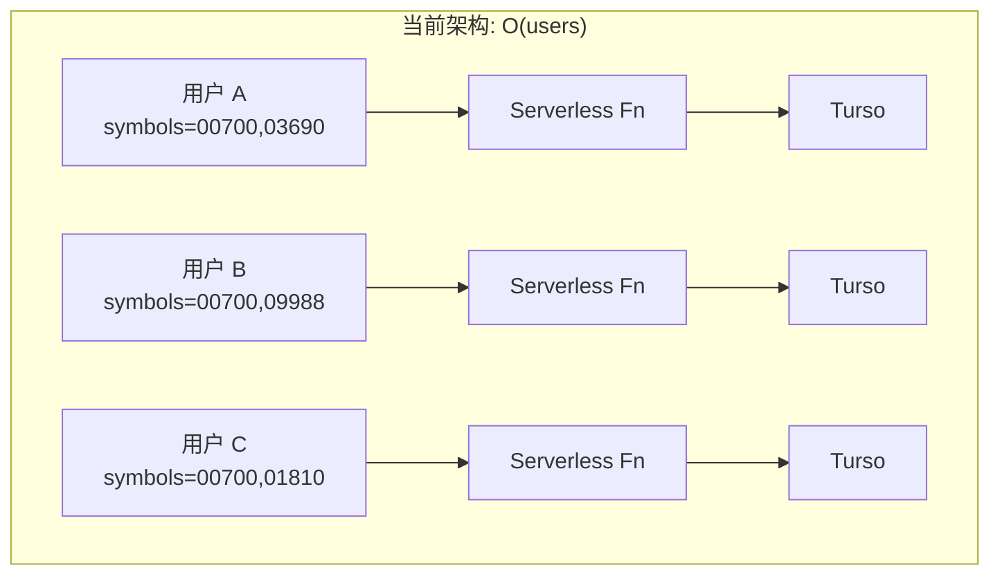
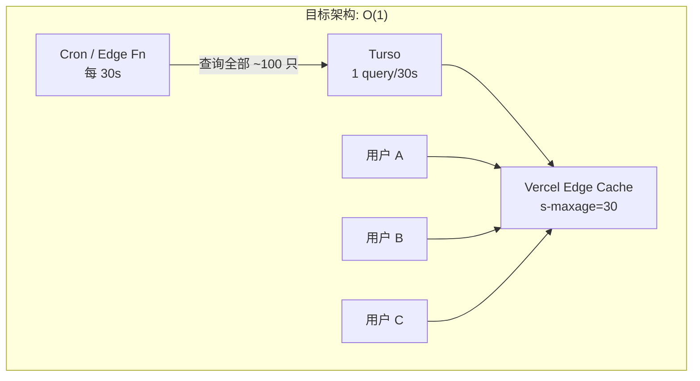
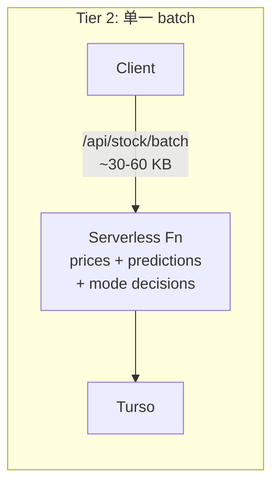
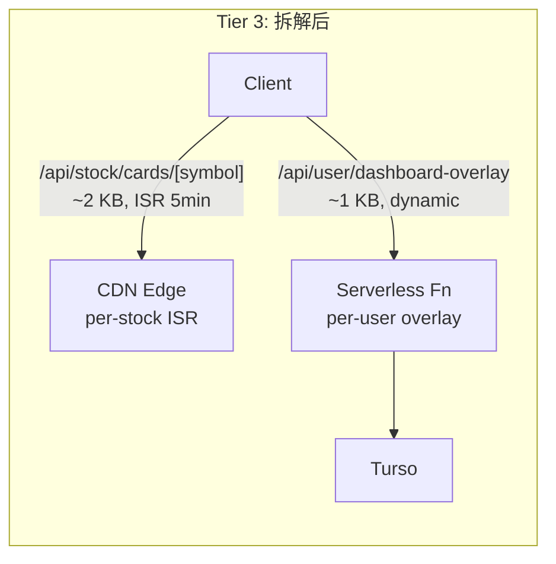

# 31. Capacity Planning & Scaling Strategy

**Date**: 2026-03-17
**Status**: Active baseline — revisit when approaching next tier threshold

## 1. Purpose

本文档回答两个核心问题：

1. **当前架构能撑多少用户？**
2. **到什么规模需要什么改造？**

文档基于 2026-03-17 的代码基线，提供从 1K 到 1M 用户的分阶段容量评估、瓶颈识别与扩容路线图。

### 交叉引用

| 文档 | 关联内容 |
|------|----------|
| [10_Architecture.md](./10_Architecture.md) | 系统拓扑、目标架构、SLO |
| [30_Stock_Data_Layers_And_API_Boundaries_20260316.md](./30_Stock_Data_Layers_And_API_Boundaries_20260316.md) | Layer A (日更决策) / Layer B (盘中价量) 分层与 API 家族 |
| [28_Price_Sync_Zero_Stale_Protocol_20260316.md](./28_Price_Sync_Zero_Stale_Protocol_20260316.md) | 缓存分层决策 (CDN bypass + server cache tiering) |
| [02_Monetization_Pricing_Strategy.md](../0_Strategy/02_Monetization_Pricing_Strategy.md) | 单位经济模型与"去重机制红利" |

---

## 2. Current Architecture Snapshot

### 2.1 Infrastructure Stack

| 层 | 技术选型 | 关键配置 |
|----|----------|----------|
| Frontend Runtime | Next.js 15.5.9 (App Router) on Vercel Serverless | 无 `maxDuration` / Edge Runtime 配置 |
| Database | Turso (libSQL) via `@libsql/client` HTTP API | 每次请求新建连接，无连接池 (`frontend/src/lib/db.ts`) |
| Backend Pipeline | Python CLI on GitHub Actions cron | 5 daily workers, 2 realtime workers |
| Push Notifications | Web Push (VAPID) via `/api/internal/notify` | Bearer token auth |
| CDN / Edge | Vercel Edge Network | API 端点已 bypass CDN (Zero-Stale Protocol) |

### 2.2 API Landscape

- **54 个 API 端点**，其中仅 2 个使用 ISR 缓存：
  - `/api/shared/almanac` — `revalidate: 3600` (1 小时)
  - `/api/history` — `revalidate: 300` (5 分钟)
- 其余全部 `force-dynamic` 或无显式缓存指令。
- **零速率限制**：Middleware (`frontend/src/middleware.ts`) 仅做域名路由和 locale 处理。

### 2.3 Client Polling Model

| 端点 | 盘中频率 | 非盘中频率 | 触发方式 |
|------|----------|------------|----------|
| `/api/stock/prices` | 每 3 min | 每 10 min | `setInterval` 定时轮询 |
| `/api/stock/batch` | 每 60 min | 每 120 min | 定时 + 回前台 |
| `/api/shared/almanac` | 1 次/会话 | 1 次/会话 | ISR 缓存 |
| `/api/stock-pool` | 1 次/会话 | 1 次/会话 | mount 时同步 |
| visibility 触发 | ~5 次/小时 | ~2 次/小时 | `visibilitychange` / `focus` / `pageshow` / `online` |

Source: `frontend/src/hooks/useDashboardData.ts` (L12-17)

### 2.4 Server-Side Caching

| 函数 | 策略 | TTL | 用途 |
|------|------|-----|------|
| `getLatestPrices` | 无缓存，直查 DB | 0 | `/api/stock/prices` |
| `getCachedLatestPrices` | `unstable_cache` | 120s (2 min) | `/api/stock/batch` |
| `getCachedShortMetrics` | `unstable_cache` | 3600s (1 hr) | `/api/stock/batch` |

Source: `frontend/src/lib/stock-cache.ts`

`unstable_cache` 的 key 包含函数参数（即 symbols 数组），因此**不同自选池组合的用户命中不同缓存条目**，跨用户共享率极低。

### 2.5 Backend Pipeline

后端数据生产管道面向**全局股票池**（`global_stock_pool`，当前约 100-200 只），不面向单个用户。

| 维度 | 值 | 是否随用户增长 |
|------|----|---------------|
| 每日同步股票数 | ~100-200 (全局池) | 否 |
| LLM 调用/天 | ~300-1000 (股票数 × 3-5 模型) | 否 |
| GitHub Actions 分钟/天 | ~30-60 min | 否 |
| 实时行情同步 | Cloudflare Worker ≈ 每 15 min (盘中) | 否 |

这与 [02_Monetization_Pricing_Strategy.md](../0_Strategy/02_Monetization_Pricing_Strategy.md) 第 5 节的"去重机制红利"一致：**系统针对"股票"计算而非"用户"，100 人看同一只热门股只算 1 次。用户规模增长，单用户边际 AI 成本无限趋近于零。**

### 2.6 Service Worker

- 静态资源 (JS/CSS/图片)：CacheFirst
- Navigation：CacheFirst + 后台 revalidate
- **所有 `/api/*` 请求：完全 bypass**，由浏览器原生处理

---

## 3. Traffic Model

### 3.1 Assumptions

| 参数 | 值 | 依据 |
|------|----|------|
| 盘中同时在线率 | 20% | 投资类 App 盘中活跃率典型值 |
| 非盘中活跃率 | 5% | 收盘后查看简报的低频用户 |
| 平均自选池大小 | 5 只 | 当前用户实际分布 |
| 港股核心交易时段 | 4 小时/天 | 9:30-12:00, 13:00-16:00 HKT |
| 月度交易日 | 22 天 | 标准 |
| 全局股票池 | ~100-200 只 | `global_stock_pool` |

### 3.2 Per-User Request Pattern (Trading Hours)

| 端点 | 频率 | req/hour |
|------|------|----------|
| `/api/stock/prices` | 每 3 min | 20 |
| `/api/stock/batch` | 每 60 min | 1 |
| `/api/shared/almanac` | ISR 缓存 | ~0 (CDN) |
| `/api/stock-pool` | 1 次/会话 | ~0.5 |
| visibility 触发 | ~5 次/小时 | 5 |
| **合计** | | **~27 req/hr** |

### 3.3 Scale Comparison

| 指标 | 1K 用户 | 10K 用户 | 100K 用户 | 1M 用户 |
|------|---------|----------|-----------|---------|
| 盘中并发 | 200 | 2,000 | 20,000 | **200,000** |
| 价格 QPS (稳态) | ~1.1 | ~11 | ~111 | **~1,111** |
| 全端点 QPS (稳态) | ~1.5 | ~15 | ~150 | **~1,500** |
| 开盘峰值 QPS (1-2 min) | ~12 | ~120 | ~1,200 | **~12,000** |
| 月度 API 调用 | ~660K | ~6.6M | ~66M | **~660M** |
| Vercel compute (无优化) | ~9 GB-hrs | ~94 GB-hrs | ~940 GB-hrs | **~9,400 GB-hrs** |
| Turso price queries/s | ~1.1 | ~11 | ~111 | **~1,111** |
| 月度带宽 | ~3 GB | ~35 GB | ~330 GB | **~3.3 TB** |

**Compute 计算方式**: 月度调用 × 200ms 平均执行 × 256MB 内存 = GB-hrs

> 注: 1M 数据假设无任何架构优化。实际进入 Tier 2 后价格层 O(1) 化，Tier 3 需进一步拆解 batch 层，实际 compute 远低于此上限。见 Section 6.4。

---

## 4. Per-Layer Capacity Assessment

### 4.1 Vercel Serverless

| 指标 | Hobby ($0) | Pro ($20/mo) | Enterprise |
|------|------------|--------------|------------|
| Compute | 100 GB-hrs | 1,000 GB-hrs | Custom |
| Bandwidth | 100 GB | 1 TB | Custom |
| Function Timeout | 10s | 60s | 900s |

| 用户规模 | 需要计划 | 状态 |
|----------|----------|------|
| 1K | Hobby 勉强可用 | 🟡 |
| 10K | **Pro 必须** (~94 GB-hrs, Pro 充裕) | 🟢 |
| 100K | **Pro 紧绷** (~940 GB-hrs, 接近 1,000 上限) | 🔴 |

### 4.2 Turso Database

| 指标 | Free | Starter ($8/mo) | Scaler ($20/mo) |
|------|------|-----------------|-----------------|
| Row Reads/月 | 9B | 24B | 更多 |
| Storage | 8 GB | 24 GB | 更多 |
| Locations | 3 | 6 | 更多 |

| 用户规模 | QPS (prices) | 月度行读取估算 | 状态 |
|----------|-------------|---------------|------|
| 1K | ~1.1 | ~20M | 🟢 Free 充裕 |
| 10K | ~11 | ~200M | 🟢 Free 充裕 |
| 100K | ~111 | ~2B | 🟢 Free 仍足够，但建议 Starter 以获得 SLA |

Turso 的行读取配额极其宽裕。瓶颈不在配额，而在：
1. **延迟**：每次 `getDbClient()` 新建 HTTP 连接的 TLS 握手开销
2. **并发**：111 req/s 时 Turso HTTP API 的响应延迟是否稳定

### 4.3 Backend Pipeline

| 用户规模 | 影响 | 状态 |
|----------|------|------|
| 1K-1M | 无影响，管道按全局股票池运行 | 🟢 |

唯一可能受影响的场景：用户增长导致全局股票池膨胀。若池从 100 只增长到 500 只，LLM 调用从 ~500/天增长到 ~2500/天，仍在可控范围内。

### 4.4 Service Worker / PWA

| 用户规模 | 影响 | 状态 |
|----------|------|------|
| 1K-1M | 无影响，静态资源由 CDN 和 SW 缓存兜底 | 🟢 |

### 4.5 Summary Traffic Light

| 层 | 1K | 10K | 100K | 1M |
|----|:--:|:---:|:----:|:--:|
| Vercel Compute | 🟡 | 🟢 | 🔴 | 🔴 |
| Turso | 🟢 | 🟢 | 🟡 | 🔴 |
| Backend Pipeline | 🟢 | 🟢 | 🟢 | 🟡 |
| PWA/CDN | 🟢 | 🟢 | 🟢 | 🟢 |
| Rate Limiting | 🔴 | 🔴 | 🔴 | 🔴 |
| Price API Dedup | 🟢 | 🟡 | 🔴 | 🔴 |
| Batch Decomposition | 🟢 | 🟢 | 🟢 | 🔴 |
| Push vs Poll | 🟢 | 🟢 | 🟡 | 🔴 |
| Multi-Region | 🟢 | 🟢 | 🟢 | 🟡 |

---

## 5. Architecture Breakpoint: O(users) to O(1)

### 5.1 The Fundamental Problem

当前价格刷新模型是 **per-user polling**：每个用户独立向服务端请求自己的自选池价格。

```
20,000 并发用户 × 每 3 分钟 1 次 = 111 req/s
→ 111 次 Turso 查询/s
→ 但他们查的是同一个全局股票池中的 ~100 只股票
```

`unstable_cache` 理论上可以去重，但其 cache key 包含完整 symbols 数组。不同自选池组合的用户命中不同缓存条目，跨用户共享率极低。

### 5.2 Price Broadcast Architecture





核心思路：新增 `/api/stock/prices/all` 端点：

- 查询 `global_stock_pool` 全部 symbol 的最新价格
- 响应体：~100 只 × ~60 bytes ≈ **6 KB**（极轻量）
- 设置 `Cache-Control: public, s-maxage=30, stale-while-revalidate=30`
- Vercel Edge 全球缓存，origin 每 30 秒只被穿透 1 次
- 客户端收到全量价格后，本地按自选池过滤

### 5.3 Efficiency Comparison

| 指标 | Per-user polling | Price broadcast | 倍数 |
|------|-----------------|-----------------|------|
| 价格 API origin hits/s (100K 用户) | 111 | **0.03** | 3,700x |
| Turso 价格查询/s | 111 | **0.03** | 3,700x |
| Vercel 函数调用/月 (价格) | ~50M | **~86K** | 580x |
| Vercel compute (价格) | ~700 GB-hrs | **~1.2 GB-hrs** | 580x |
| 用户感知价格新鲜度 | 3 min | **30s** | 更好 |

**关键洞察：不仅成本暴降，用户感知的价格新鲜度反而从 3 分钟提升到 30 秒。**

### 5.4 Why This Works for StockWise

此方案可行的前提条件 — StockWise 恰好全部满足：

1. **全局股票池有限** — ~100-200 只，不是全市场数万只
2. **价格数据是公共的** — 同一只股票的价格对所有用户一致
3. **日线级快照** — 不是逐笔行情，数据更新频率本就不高
4. **响应体极小** — 6 KB 的 CDN 缓存对任何边缘节点都是微不足道的

---

## 6. Scaling Roadmap

### Tier 0: Current (~1K users)

**触发条件**: 当前状态
**状态**: 可运行，存在安全隐患

| 项目 | 状态 |
|------|------|
| 现有轮询模型 | 可承受 |
| 速率限制 | ❌ 缺失 |
| Vercel 计划 | Hobby 可用但无余量 |

### Tier 1: 10K Users

**触发条件**: MAU 接近 5,000 或盘中并发超过 500

**必须完成的改造**:

| 项目 | 描述 | 预估工期 |
|------|------|----------|
| Per-symbol 内存缓存 | 在 `stock-cache.ts` 中为 `getLatestPrices` 增加进程级 Map 缓存，30s TTL，per-symbol key。热门股票跨用户共享。 | 0.5 天 |
| API 速率限制 | middleware 或 API 层增加 per-IP / per-session 限制：全局 60 req/min, prices 30 req/min, batch 5 req/min | 1 天 |
| Vercel Pro | 确认部署在 Pro 计划 | 配置变更 |
| 请求抖动 | 客户端定时器加入 0-30s 随机延迟，缓解开盘惊群 | 0.5 天 |
| DB 单例化 | `getDbClient()` 改为模块级单例，减少 TLS 握手开销 | 0.5 天 |
| 低频端点 ISR | `/api/system/calendar` (1d), `/api/learn/*` (1h) | 0.5 天 |

**预估总工期**: 2-3 天
**基础设施月成本增量**: Vercel Pro $20/mo

### Tier 2: 100K Users

**触发条件**: MAU 接近 50,000 或盘中并发超过 5,000 或 Vercel compute 超过 500 GB-hrs/月

**必须完成的改造**:

| 项目 | 描述 | 预估工期 |
|------|------|----------|
| 价格广播架构 | 新增 `/api/stock/prices/all`，CDN 缓存 30s，客户端改用全量端点 | 2 天 |
| Batch 公共层 ISR | 拆出 per-symbol 预测摘要做 ISR，用户私有部分保持 dynamic | 3 天 |
| 监控告警 | p95 延迟、错误率、Turso 行读取、Vercel compute 用量告警 | 1 天 |
| 评估 Vercel Enterprise | 若 Pro compute 接近上限，评估 Enterprise 或迁移策略 | 评估 |

**预估总工期**: 1-2 周
**基础设施月成本增量**: Vercel Pro/Enterprise $20-200/mo, Turso Starter $8/mo

### Tier 3: 1M Users

**触发条件**: MAU 接近 500,000 或盘中并发超过 50,000 或 Vercel compute 超过 800 GB-hrs/月

#### 6.4.1 为什么 Tier 2 的优化不够

Tier 2 的价格广播架构将价格层降为 O(1)。但在 1M 规模下，**非价格端点**成为新的瓶颈：

```
盘中并发: 200,000 用户

非价格端点稳态 QPS:
  /api/stock/batch       200,000 × 1/hr     = ~56 req/s
  /api/stock-pool        200,000 × 0.5/hr   = ~28 req/s
  visibility 触发        200,000 × 5/hr     = ~278 req/s
  其他 (predictions, modes, etc.)            = ~80 req/s
  合计:                                      = ~442 req/s

开盘峰值: ~5,000+ req/s (1-2 分钟内)

月度 compute (仅非价格): ~442 × 3600 × 8h × 30d × 200ms × 256MB
                        ≈ 5,400 GB-hrs → Vercel Pro 上限的 5.4 倍
```

价格层已经 O(1) 化，但 **batch 端点承载的决策载荷是 per-user 的**（不同用户有不同 tier/mode/watchlist 组合），无法用同一招解决。

#### 6.4.2 The Next Breakpoint: Batch Decomposition

Batch 端点 (`/api/stock/batch`) 当前返回的数据可以分为两类：

| 类型 | 内容 | 是否因用户而异 | 可缓存性 |
|------|------|---------------|----------|
| **Per-stock public** | 预测信号、AI 推理、Layer1 状态、历史预测、卖空指标 | 否 (同一只股票对所有用户一致) | 高: ISR / CDN |
| **Per-user private** | 投资模式决策语义 (`decision_semantic`)、mode overlay、lastUpdated 标签 | 是 (取决于用户 tier + mode) | 低: 必须 dynamic |

拆解方案：





- **Per-stock card** (`/api/stock/cards/[symbol]`):
  - 返回: 预测信号、confidence、AI 推理摘要、Layer1 状态、历史 5 条
  - `revalidate: 300` (5 min ISR)
  - 每只股票全球只有一份缓存，200K 用户命中 CDN → **O(1) per stock**
  - 100 只股票 × 1 revalidation/5min = 0.33 origin hits/s

- **Per-user overlay** (`/api/user/dashboard-overlay`):
  - 返回: 每只股票的 `decision_semantic` (基于用户 mode)、lastUpdated 标签
  - 极轻量 (~1 KB)，dynamic
  - 但仅包含 overlay 字段，不包含完整预测/推理 → **函数执行 <50ms**

效果:

| 指标 | 当前 batch (100K) | 拆解后 (1M) |
|------|-------------------|-------------|
| Origin hits/s (200K 并发) | ~56 (heavy) | ~56 (ultra-light overlay) + ~0.33 (ISR card) |
| Per-request compute | ~200ms | ~50ms (overlay) |
| Vercel compute/月 | ~5,400 GB-hrs | **~1,350 GB-hrs** |
| Per-request 带宽 | ~30-60 KB | ~1-2 KB (overlay) + CDN (cards) |

Vercel compute 降至 ~1,350 GB-hrs，仍超 Pro 上限但已在 Enterprise 合理范围内。或可通过平台迁移进一步降低。

#### 6.4.3 Push over Poll

在 1M 规模下，轮询模型的另一个问题浮现：**绝大多数 visibility 轮询返回的数据与上一次完全一致**。

当前: 200,000 × 5 visibility events/hr = 278 req/s，其中估计 90%+ 无新数据可返回。

替代方案: Server-Sent Events (SSE) 或 WebSocket

| 维度 | 轮询 (当前) | SSE / WebSocket |
|------|------------|-----------------|
| 空转请求 | ~250 req/s (浪费) | 0 |
| 数据延迟 | 3 min (盘中) | 实时 (~1s) |
| 服务端并发连接 | 无持久连接 | 200,000 持久连接 |
| Vercel 兼容性 | 完全兼容 | Serverless 不支持持久连接 |

**关键制约**: Vercel Serverless Functions 不支持持久连接（函数最长执行 60s/900s），因此 SSE/WS 需要**独立基础设施**:

- **选项 A**: 使用 Ably / Pusher / Soketi 等托管实时服务
  - 优点: 零运维，按连接数计费
  - 缺点: 200K 并发连接的成本 (~$200-500/mo)

- **选项 B**: 自部署 SSE 服务 (Cloudflare Durable Objects / Fly.io / Railway)
  - 优点: 成本更低，完全控制
  - 缺点: 需要运维
  - 架构: 后端管道写入价格后 → publish 到 SSE broker → 所有客户端收到推送

- **选项 C**: 混合模式 — 保留轮询但大幅降频
  - 价格: 广播架构已解决 (CDN)
  - 决策: 改为 per-stock ISR card (CDN)
  - 用户 overlay: 10-30 min 低频轮询 (仅 mode 变化时才有新数据)
  - visibility 触发: 仅检查 last-modified header，无变化时不解析 body

**推荐**: 选项 C (混合模式) 作为 Tier 3 首选，选项 A/B 作为 Tier 4 预研。混合模式不需要引入新的基础设施，仅通过拆解 + 降频即可将 compute 降至 Enterprise 可控范围。

#### 6.4.4 Multi-Region

1M 用户意味着地理分布更广。Turso 原生支持 read replica:

- Primary: 当前 region (e.g., `sin` 新加坡)
- Read replica: `hkg` (香港), `nrt` (东京), `sfo` (美西)
- Vercel Serverless 自动就近访问最近的 replica
- 写入仍走 primary (仅后端管道写入)

**成本**: Turso Scaler ($20/mo) 支持更多 locations。实际增量成本极低。

#### 6.4.5 Platform Migration Evaluation

在 1M 规模下，Vercel 的 compute-hour 计费模型变得昂贵。替代平台对比:

| 平台 | 计费模型 | 1M 用户估算月成本 | 优点 | 缺点 |
|------|----------|-----------------|------|------|
| Vercel Enterprise | Custom GB-hrs | $500-2,000 | 零迁移成本，Next.js 原生 | 最贵 |
| Cloudflare Workers | $0.50/M requests | ~$190 (380M req) | 极低成本，全球 Edge | 需迁移，不支持 Node.js 全部 API |
| Fly.io / Railway | 按 container 时间 | ~$100-300 | 支持持久连接 (SSE/WS) | 需容器化，运维成本 |
| 混合: Vercel (SSR) + CF Workers (API) | 分层计费 | ~$120-400 | 各取所长 | 架构复杂度增加 |

**推荐评估路径**: 当 Vercel Pro compute 接近 800 GB-hrs/月时，开始 POC 对比 Cloudflare Workers。迁移的最佳候选端点是轻量、无状态的价格和 ISR card 端点。

#### 6.4.6 Summary: Tier 3 Roadmap

| 项目 | 描述 | 前置条件 | 预估工期 |
|------|------|----------|----------|
| Batch 拆解 | 分离 per-stock ISR card + per-user overlay | Tier 2 完成 | 1-2 周 |
| 混合降频 | visibility 轮询改为 last-modified 检查 + overlay 降频至 10-30 min | Batch 拆解完成 | 2-3 天 |
| Turso multi-region | 添加 HK / 东京 read replica | Turso Scaler 计划 | 1 天 |
| 平台评估 | POC Cloudflare Workers 迁移 | 基于 compute 监控数据 | 1 周 |
| 支付通道分流 | 国内流量转微信/支付宝，海外保留 Airwallex | 呼应 02_Monetization 第 5 节 | 1-2 周 |
| SSE/WS 预研 | 评估托管实时服务 vs 自部署 | 仅当混合模式不足时 | 评估 |

**预估总工期**: 3-5 周
**基础设施月成本**: $200-500 (Vercel Enterprise 或混合平台)

### Tier 4: Beyond 1M (Directional Only)

**方向性改造** (仅记录方向，不要求立即设计):

| 项目 | 描述 |
|------|------|
| 独立价格/行情微服务 | 将价格层从 Next.js monolith 拆出为独立服务 (Cloudflare Worker 或专用节点)，独立扩缩容 |
| SSE 实时推送 | 用推送替代所有剩余轮询，彻底消除空转请求 |
| CDN-first 架构 | 所有 per-stock 数据默认 CDN 缓存，仅 per-user overlay 走 origin |
| 数据库分层 | 热数据 (价格/预测) 用 Redis/KV 服务，冷数据 (历史/traces) 留 Turso |
| 全球化部署 | 多 region Vercel deployment + Turso global replica mesh |

---

## 7. Infrastructure Cost Model

### 7.1 Per-Tier Monthly Cost Estimate

| 项目 | 1K 用户 | 10K 用户 | 100K 用户 | 1M 用户 |
|------|---------|----------|-----------|---------|
| Vercel | $0 (Hobby) | **$20** (Pro) | **$20-200** (Pro/Ent.) | **$200-2,000** (Enterprise / 混合) |
| Turso | $0 (Free) | $0-8 (Free/Starter) | **$8-20** (Starter/Scaler) | **$20-50** (Scaler + replicas) |
| GitHub Actions | $0 (Free) | $0 | $0-4 | $4-20 |
| LLM API (per-stock) | ~$3 | ~$3 | ~$3 | ~$3-66 (池扩大) |
| 实时推送 (可选) | $0 | $0 | $0 | $0-500 (Ably/自建) |
| Domain / DNS | ~$2 | ~$2 | ~$2 | ~$5 |
| **Total** | **~$5/mo** | **~$25/mo** | **~$35-230/mo** | **~$230-2,640/mo** |

> 1M 成本区间较大，取决于平台选择 (Vercel Enterprise vs Cloudflare Workers 混合) 和是否引入实时推送服务。

### 7.2 Unit Economics

引用 [02_Monetization_Pricing_Strategy.md](../0_Strategy/02_Monetization_Pricing_Strategy.md)：

- Pro 年费: ¥299/年 ≈ $41/年 ≈ $3.4/月
- 盈亏平衡: 25-30 名年费会员即覆盖计算成本

| 规模 | 月基础设施成本 | 需要多少年费会员覆盖 | 占用户基百分比 |
|------|---------------|---------------------|---------------|
| 1K | ~$5 | ~2 | 0.2% |
| 10K | ~$25 | ~8 | 0.08% |
| 100K (广播架构后) | ~$35 | ~11 | 0.01% |
| 100K (无优化) | ~$230 | ~68 | 0.07% |
| 1M (batch 拆解后, 低) | ~$230 | ~68 | 0.007% |
| 1M (Enterprise + push, 高) | ~$2,640 | ~776 | 0.08% |

**关键洞察:**

1. **成本不随用户线性增长。** 从 100K 到 1M（10 倍用户），成本仅增长 ~7-11 倍（低端方案），这得益于 O(1) 价格广播 + per-stock ISR card 的去重效应。
2. **即使在 1M 规模最贵方案下 ($2,640/mo)，也仅需 776 名年费会员覆盖**，占 1M 用户基的 0.08% — 这是极其健康的单位经济模型。
3. **平台选择是 1M 阶段最大的成本杠杆。** Vercel Enterprise 与 Cloudflare Workers 混合部署的成本可能相差 5-10 倍。

### 7.3 Backend Pipeline Cost: Scale-Invariant

后端 LLM 成本按全局股票池计算，与用户数完全脱钩：

```
100 只股票 × 5 模型 × ¥0.032/次 = ¥16/天 ≈ $2.2/天 ≈ $66/月
```

若股票池扩展到 500 只: ~$330/月。这一成本由 Pro 会员直接覆盖，与用户规模无关。

### 7.4 Cost Scaling Curve

```
月成本 ($)
  ^
  |                                           * $2,640 (1M, 高)
  |
  |
  |
  |
  |                               * $230 (100K 无优化 / 1M 低)
  |
  |                      * $35 (100K 优化后)
  |             * $25 (10K)
  |    * $5 (1K)
  +----+--------+---------+----------+-----> 用户规模
      1K      10K      100K        1M
```

成本曲线的核心特征: **每一次架构优化 (per-symbol cache → price broadcast → batch decomposition) 都将成本曲线"压平"一个数量级**。这意味着扩容的经济性取决于是否在正确的时机执行正确的架构升级。

---

## 8. Decision Log

### 8.1 2026-03-17: Server-Side Cache Tiering

**背景**: 用户反馈自选池和首页价格不及时更新，即使浏览器刷新或 PWA 冷启动也看到旧价格。

**根因**: `getCachedLatestPrices` 使用 `unstable_cache` 设置了 15 分钟 TTL。由于 stale-while-revalidate 语义，实际延迟可达 ~30 分钟。客户端的 `no-store` 和 cache-buster 只能绕过浏览器/CDN，无法绕过服务端数据缓存。

**决策**:
- `/api/stock/prices` 改用无缓存 `getLatestPrices`，每次直查 DB
- `/api/stock/batch` 的 `getCachedLatestPrices` TTL 从 900s 降至 120s
- `getCachedShortMetrics` 保持 3600s 不变

**影响评估**: 在当前 ~1K 用户规模下，无缓存直查对 Turso 负载可忽略。在 10K 规模需补充 per-symbol 内存缓存，在 100K 规模需迁移到价格广播架构。

详见: [28_Price_Sync_Zero_Stale_Protocol_20260316.md](./28_Price_Sync_Zero_Stale_Protocol_20260316.md) Section 6

### 8.2 (Reserved) Future Scaling Decisions

后续扩容决策在此追加记录。

---

## 9. Appendix: Key Source References

| 文件 | 关联内容 |
|------|----------|
| `frontend/src/lib/stock-cache.ts` | 价格缓存分层 (getLatestPrices / getCachedLatestPrices) |
| `frontend/src/hooks/useDashboardData.ts` L12-17 | 客户端轮询间隔定义 |
| `frontend/src/lib/db.ts` L32-57 | Turso 连接创建模式 (每次新建) |
| `frontend/src/middleware.ts` | Middleware (无速率限制) |
| `frontend/src/app/api/stock/prices/route.ts` | 价格刷新端点 (force-dynamic, no-store) |
| `frontend/src/app/api/stock/batch/route.ts` | 决策批量端点 (force-dynamic, no-store) |
| `frontend/public/sw.js` L306-310 | Service Worker API bypass |
| `backend/db_repo/queries.py` | `GET_STOCK_POOL_QUERY` (全局股票池) |
| `backend/main.py` | 后端管道任务编排 |
