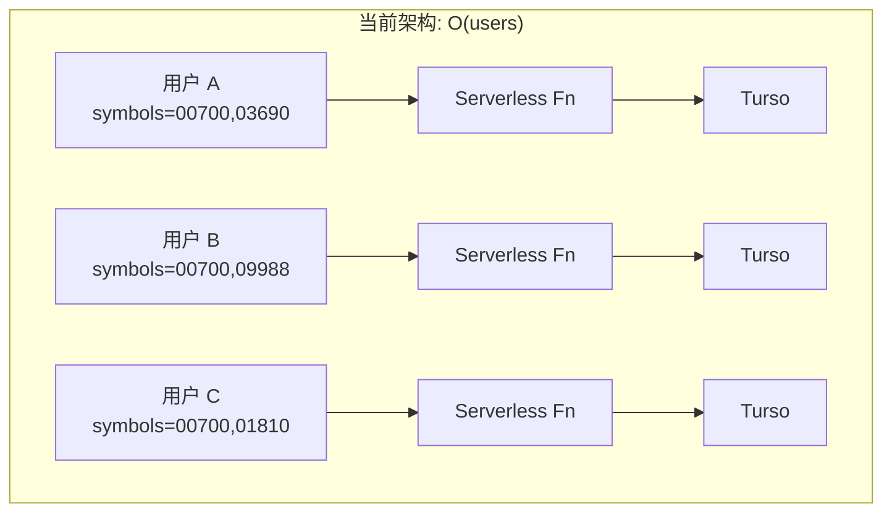
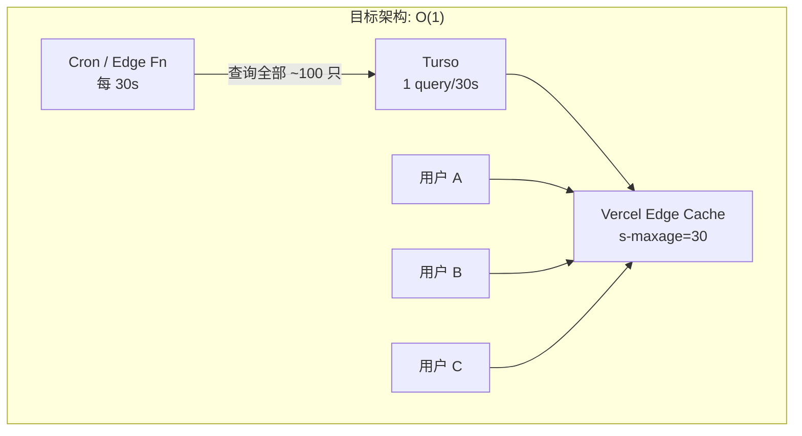
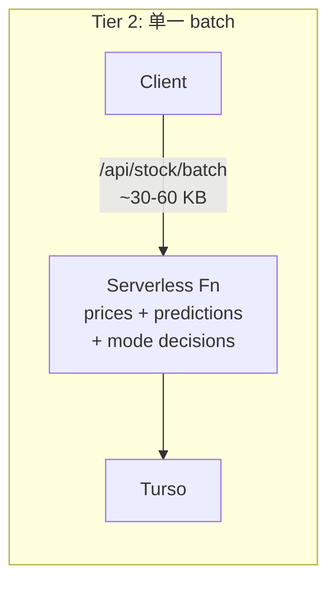
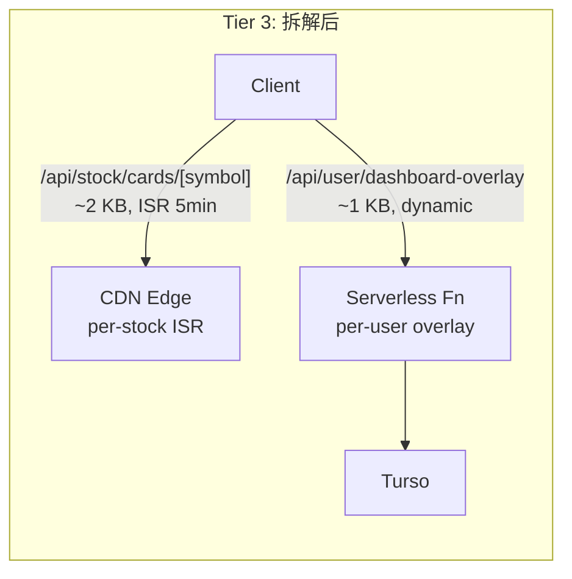

# 31. Capacity Planning & Scaling Strategy

**Date**: 2026-03-17
**Status**: Active baseline — revisit when approaching next tier threshold

> 2026-03-19 实施更新（Production）：
> - 价格广播第一步已上线：`/api/stock/prices/all`（`market=all|hk|cn`）+ 30s 广播缓存 + 客户端本地过滤。
> - 前端盘中价格刷新已从 3 分钟调整为 1 分钟；非交易时段保持 10 分钟。
> - 已增加广播失败自动降级：连续失败后回退到 legacy `/api/stock/prices?symbols=...`，冷却后自动探测恢复。
> - `global_stock_pool` 管理 bug 已修复（增删幂等、`1->0` 删除），并完成线上脏数据对账清理（计数一致）。

## Document Ownership & Scope Boundary

为避免工程文档重复扩散，本文件是容量与扩容路线的单一主文档（single source of truth）：

- **本文件（31）负责**：`做什么`、`什么时候做`、`到哪个规模触发`（Tier roadmap + breakpoints）。
- **[33_Cloudflare_Workers_Migration_POC_20260318.md](./33_Cloudflare_Workers_Migration_POC_20260318.md) 负责**：Cloudflare POC 的实验方法、结果数据与结论证据（不是实施主计划）。
- **[32_Frontend_Network_Optimization_Zero_Redundancy_20260318.md](./32_Frontend_Network_Optimization_Zero_Redundancy_20260318.md) 负责**：前端请求冗余治理的实现细则（是本路线图的专项子方案）。

执行顺序约束（以本文件为准）：

1. 先完成价格层 broadcast（`/api/stock/prices/all` + 缓存 + 客户端过滤）并稳定运行；
2. 再评估是否将该公共端点迁移到 Cloudflare Workers；
3. `batch` 按 public/private 拆分后，再决定公共部分的迁移范围。

## 1. Purpose

本文档回答两个核心问题：

1. **当前架构能撑多少用户？**
2. **到什么规模需要什么改造？**

文档基于 2026-03-17 的代码基线，提供从 1K 到 1M 用户的分阶段容量评估、瓶颈识别与扩容路线图。

### 交叉引用

| 文档 | 关联内容 |
|------|----------|
| [10_Architecture.md](./10_Architecture.md) | 系统拓扑、目标架构、SLO |
| [30_Stock_Data_Layers_And_API_Boundaries_20260316.md](./30_Stock_Data_Layers_And_API_Boundaries_20260316.md) | Layer A (日更决策) / Layer B (盘中价量) 分层与 API 家族 |
| [28_Price_Sync_Zero_Stale_Protocol_20260316.md](./28_Price_Sync_Zero_Stale_Protocol_20260316.md) | 缓存分层决策 (CDN bypass + server cache tiering) |
| [02_Monetization_Pricing_Strategy.md](../0_Strategy/02_Monetization_Pricing_Strategy.md) | 单位经济模型与"去重机制红利" |

---

## 2. Current Architecture Snapshot

### 2.1 Infrastructure Stack

| 层 | 技术选型 | 关键配置 |
|----|----------|----------|
| Frontend Runtime | Next.js 15.5.9 (App Router) on Vercel Serverless | 无 `maxDuration` / Edge Runtime 配置 |
| Database | Turso (libSQL) via `@libsql/client` HTTP API | 模块级单例连接 (`frontend/src/lib/db.ts`)，消除 per-request TLS 握手 |
| Backend Pipeline | Python CLI on GitHub Actions cron | 5 daily workers, 2 realtime workers |
| Push Notifications | Web Push (VAPID) via `/api/internal/notify` | Bearer token auth |
| CDN / Edge | Vercel Edge Network | API 端点已 bypass CDN (Zero-Stale Protocol) |

### 2.2 API Landscape

- **54 个 API 端点**，其中仅 2 个使用 ISR 缓存：
  - `/api/shared/almanac` — `revalidate: 3600` (1 小时)
  - `/api/history` — `revalidate: 300` (5 分钟)
- 其余全部 `force-dynamic` 或无显式缓存指令。
- **零速率限制**：Middleware (`frontend/src/middleware.ts`) 仅做域名路由和 locale 处理。

### 2.3 Client Request Model

#### 2.3.1 Initial Page Load (Cold Start)

实测数据 (2026-03-17, PC Chrome, 单次刷新 `app.ziso.cc/dashboard/stock-pool`):

| # | 方法 | 端点 | 状态 | 实测耗时 | 触发源 |
|---|------|------|------|----------|--------|
| 1 | GET | `/` | 304 | — | 导航 |
| 2 | GET | `/dashboard` | 307 | — | 重定向 |
| 3 | GET | `/api/stock-pool` | 200 | 1.05s | `useWatchlist` mount |
| 4 | GET | `/api/shared/almanac` | 200 | 217ms | ISR 缓存 |
| 5 | GET | `/api/stock/batch` | 200 | **6.15s** | `useDashboardData` mount |
| 6 | GET | `/api/stock/prices` | 200 | **2.14s** | `useDashboardData` mount |
| 7 | GET | `/api/system/calendar` | 200 | 1.31s | `SystemSync` mount |
| 8 | GET | `/dashboard/stock-pool` | 304 | — | 页面 SSR |
| 9 | POST | `/api/user/register` | 200 | — | `getCurrentUser()` → `syncCurrentUserSession()` |
| 10 | POST | `/api/user/profile` | 200 | 1.27s | `useUserProfile` mount |

**关键观察**: 单次页面刷新产生 **8 个 API origin hits** (排除 SSR/redirect)。总瀑布时间 **6.33s** (bottleneck: batch 端点)。

- `register` 实际是 "ensure session / upsert user" 语义，每 5 分钟同步一次 (`USER_SESSION_SYNC_INTERVAL_MS`)，由 `getCurrentUser()` 触发
- `profile` 在 Provider mount 时自动调用，有 30 秒防抖但首次加载必触发
- `calendar` 由全局 `SystemSync` 组件 mount 时触发，`force-dynamic` 无任何缓存

**Chrome 总览**: 38 requests, 6.7 kB transferred, 1.8 MB resources, DOMContentLoaded: 95ms, Finish: 6.33s。静态资源全部 SW/memory cache 命中 (0ms)。

Source: Production Vercel logs + Chrome DevTools Network, 2026-03-17 17:44:31 HKT

#### 2.3.2 Steady-State Polling

| 端点 | 盘中频率 | 非盘中频率 | 触发方式 |
|------|----------|------------|----------|
| `/api/stock/prices/all` | 每 1 min | 每 10 min | 主路径：广播快照（客户端本地过滤） |
| `/api/stock/prices` | 降级兜底 | 降级兜底 | 广播熔断时自动回退 |
| `/api/stock/batch` | 每 60 min | 每 120 min | 定时 + 回前台 |
| `/api/shared/almanac` | 1 次/会话 | 1 次/会话 | ISR 缓存 |
| `/api/stock-pool` | 1 次/会话 | 1 次/会话 | mount 时同步 |
| `/api/user/register` | ≤1 次/5min | ≤1 次/5min | `getCurrentUser()` 会话同步 (5min 防抖) |
| `/api/user/profile` | 1 次/会话 | 1 次/会话 | Provider mount (30s 防抖) |
| `/api/system/calendar` | 1 次/hr | 1 次/hr | `SystemSync` setInterval |
| visibility 触发 | ~5 次/小时 | ~2 次/小时 | `visibilitychange` / `focus` / `pageshow` / `online` |

Source: `frontend/src/hooks/useDashboardData.ts` (L12-17), `frontend/src/lib/user.ts` (L19), `frontend/src/hooks/useUserProfile.ts` (L109), `frontend/src/components/SystemSync.tsx` (L32)

### 2.4 Server-Side Caching

| 函数 | 策略 | TTL | 用途 |
|------|------|-----|------|
| `getLatestPrices` | 无缓存，直查 DB | 0 | `/api/stock/prices` |
| `getCachedLatestPrices` | `unstable_cache` | 120s (2 min) | `/api/stock/batch` |
| `getCachedShortMetrics` | `unstable_cache` | 3600s (1 hr) | `/api/stock/batch` |
| `_predCache` (prediction history) | 进程级 `Map` | 300s (5 min) | `/api/stock/batch` 预测查询 |

Source: `frontend/src/lib/stock-cache.ts`, `frontend/src/app/api/stock/batch/route.ts`

`unstable_cache` 的 key 包含函数参数（即 symbols 数组），因此**不同自选池组合的用户命中不同缓存条目**，跨用户共享率极低。预测缓存 `_predCache` 以 `symbols|historyLimit|tier|modeId` 为 key，同 tier/mode 的用户可共享缓存条目，5 分钟内重复请求直接命中内存。

### 2.5 Backend Pipeline

后端数据生产管道面向**全局股票池**（`global_stock_pool`，当前约 100-200 只），不面向单个用户。

| 维度 | 值 | 是否随用户增长 |
|------|----|---------------|
| 每日同步股票数 | ~100-200 (全局池) | 否 |
| LLM 调用/天 | ~300-1000 (股票数 × 3-5 模型) | 否 |
| GitHub Actions 分钟/天 | ~30-60 min | 否 |
| 实时行情同步 | Cloudflare Worker ≈ 每 15 min (盘中) | 否 |

这与 [02_Monetization_Pricing_Strategy.md](../0_Strategy/02_Monetization_Pricing_Strategy.md) 第 5 节的"去重机制红利"一致：**系统针对"股票"计算而非"用户"，100 人看同一只热门股只算 1 次。用户规模增长，单用户边际 AI 成本无限趋近于零。**

### 2.6 Service Worker

- 静态资源 (JS/CSS/图片)：CacheFirst
- Navigation：CacheFirst + 后台 revalidate
- **所有 `/api/*` 请求：完全 bypass**，由浏览器原生处理

---

## 3. Traffic Model

### 3.1 Assumptions

| 参数 | 值 | 依据 |
|------|----|------|
| 盘中同时在线率 | 20% | 投资类 App 盘中活跃率典型值 |
| 非盘中活跃率 | 5% | 收盘后查看简报的低频用户 |
| 平均自选池大小 | 5 只 | 当前用户实际分布 |
| 港股核心交易时段 | 4 小时/天 | 9:30-12:00, 13:00-16:00 HKT |
| 月度交易日 | 22 天 | 标准 |
| 全局股票池 | ~100-200 只 | `global_stock_pool` |

### 3.2 Per-User Request Pattern (Trading Hours)

| 端点 | 频率 | req/hour | 备注 |
|------|------|----------|------|
| `/api/stock/prices` | 每 3 min | 20 | 最频繁端点 |
| `/api/stock/batch` | 每 60 min | 1 | 最重端点 (p95 ~6s) |
| `/api/shared/almanac` | ISR 缓存 | ~0 (CDN) | |
| `/api/stock-pool` | 1 次/会话 | ~0.5 | |
| `/api/user/register` | ≤1 次/5min | ~3 | 会话同步 (upsert, 5min 防抖) |
| `/api/user/profile` | 1 次/会话 | ~0.5 | Provider mount (30s 防抖) |
| `/api/system/calendar` | 1 次/hr | 1 | force-dynamic, ISR 候选 |
| visibility 触发 | ~5 次/小时 | 5 | |
| **稳态合计** | | **~31 req/hr** | |
| **+页面刷新 burst** | 2 次/会话 × ~8 req | **+~4 req/hr** | 见 Section 2.3.1 |
| **综合估算** | | **~35 req/hr** | |

> 注: 之前版本估算为 ~27 req/hr，漏算了 register、profile、calendar 端点。含页面刷新 burst 的综合估算为 ~35 req/hr (+30%)。

### 3.3 Scale Comparison

| 指标 | 1K 用户 | 10K 用户 | 100K 用户 | 1M 用户 |
|------|---------|----------|-----------|---------|
| 盘中并发 | 200 | 2,000 | 20,000 | **200,000** |
| 价格 QPS (稳态) | ~1.4 | ~14 | ~140 | **~1,400** |
| 全端点 QPS (稳态) | ~1.9 | ~19 | ~194 | **~1,944** |
| 开盘峰值 QPS (1-2 min) | ~16 | ~160 | ~1,600 | **~16,000** |
| 月度 API 调用 | ~860K | ~8.6M | ~86M | **~860M** |
| Vercel compute (乐观, 200ms avg) | ~12 GB-hrs | ~122 GB-hrs | ~1,220 GB-hrs | **~12,200 GB-hrs** |
| Vercel compute (实测校准, 见下) | ~48 GB-hrs | ~480 GB-hrs | ~4,800 GB-hrs | **~48,000 GB-hrs** |
| Turso price queries/s | ~1.4 | ~14 | ~140 | **~1,400** |
| 月度带宽 | ~4 GB | ~45 GB | ~430 GB | **~4.3 TB** |

**Compute 计算方式**: 月度调用 × 平均执行时间 × 256MB 内存 = GB-hrs

#### 实测校准 (2026-03-17)

文档初始版本使用 200ms 均匀平均执行时间。生产实测 (Chrome DevTools, 1 只自选股) 显示端点延迟差异巨大:

| 端点 | 实测端到端延迟 | 估算函数 CPU 时间 | 备注 |
|------|---------------|------------------|------|
| `/api/stock/batch` | **6.15s** | ~800ms-2s | 含外部 fallback 重试 + 复杂 SQL; CPU 占比约 15-30% |
| `/api/stock/prices` | **2.14s** | ~200-400ms | TLS 握手 + Turso HTTP 往返; IO 等待为主 |
| `/api/system/calendar` | **1.31s** | ~100-200ms | 简单查询, 延迟主要来自新建 DB 连接 |
| `/api/user/profile` | **1.27s** | ~200-400ms | 多次 DB 查询 (user + watchlist + referral) |
| `/api/stock-pool` | **1.05s** | ~100-200ms | 简单查询 |
| `/api/shared/almanac` | **217ms** | ~50-100ms | ISR 缓存命中 |

Vercel 计费基于函数 CPU 执行时间 (非端到端延迟)，IO 等待 (Turso HTTP roundtrip、外部服务) 期间 CPU 空闲不计费。但即使以保守的 CPU 占比估算，**加权平均函数执行时间约为 400-800ms**，是 200ms 假设的 **2-4 倍**。

上方表格中 "实测校准" 行使用 800ms 加权平均执行时间，代表当前未优化状态下的合理上界。

> **重要**: 1M 数据假设无任何架构优化。实际进入 Tier 2 后价格层 O(1) 化，Tier 3 需进一步拆解 batch 层，实际 compute 远低于此上限。见 Section 6.4。
>
> batch 端点的 6.15s 响应时间中，`[Batch] Cloud rich history failed, falling back...` 表明存在外部依赖 (mode_decision_log JOIN) 失败后的 fallback 重试，这一路径本身贡献了 ~3-4s 延迟。修复 schema 问题或设置更短的 fallback timeout 可显著降低 batch 延迟。

---

## 4. Per-Layer Capacity Assessment

### 4.1 Vercel Serverless

| 指标 | Hobby ($0) | Pro ($20/mo) | Enterprise |
|------|------------|--------------|------------|
| Compute | 100 GB-hrs | 1,000 GB-hrs | Custom |
| Bandwidth | 100 GB | 1 TB | Custom |
| Function Timeout | 10s | 60s | 900s |

| 用户规模 | 需要计划 (乐观 200ms) | 需要计划 (实测校准) | 状态 |
|----------|----------------------|---------------------|------|
| 1K | ~12 GB-hrs, Hobby 可用 | ~48 GB-hrs, **Hobby 占半** | 🟡 |
| 10K | ~122 GB-hrs, Pro 充裕 | ~480 GB-hrs, **Pro 占半** | 🟡 |
| 100K | ~1,220 GB-hrs, Pro 超限 | ~4,800 GB-hrs, **Enterprise 必须** | 🔴 |

### 4.2 Turso Database

| 指标 | Free | Starter ($8/mo) | Scaler ($20/mo) |
|------|------|-----------------|-----------------|
| Row Reads/月 | 9B | 24B | 更多 |
| Storage | 8 GB | 24 GB | 更多 |
| Locations | 3 | 6 | 更多 |

| 用户规模 | QPS (prices) | 月度行读取估算 | 状态 |
|----------|-------------|---------------|------|
| 1K | ~1.1 | ~20M | 🟢 Free 充裕 |
| 10K | ~11 | ~200M | 🟢 Free 充裕 |
| 100K | ~111 | ~2B | 🟢 Free 仍足够，但建议 Starter 以获得 SLA |

Turso 的行读取配额极其宽裕。瓶颈不在配额，而在：
1. **延迟**：每次 `getDbClient()` 新建 HTTP 连接的 TLS 握手开销
2. **并发**：111 req/s 时 Turso HTTP API 的响应延迟是否稳定

### 4.3 Backend Pipeline

| 用户规模 | 影响 | 状态 |
|----------|------|------|
| 1K-1M | 无影响，管道按全局股票池运行 | 🟢 |

唯一可能受影响的场景：用户增长导致全局股票池膨胀。若池从 100 只增长到 500 只，LLM 调用从 ~500/天增长到 ~2500/天，仍在可控范围内。

### 4.4 Service Worker / PWA

| 用户规模 | 影响 | 状态 |
|----------|------|------|
| 1K-1M | 无影响，静态资源由 CDN 和 SW 缓存兜底 | 🟢 |

### 4.5 Summary Traffic Light

| 层 | 1K | 10K | 100K | 1M |
|----|:--:|:---:|:----:|:--:|
| Vercel Compute | 🟡 | 🟡 | 🔴 | 🔴 |
| Turso | 🟢 | 🟢 | 🟡 | 🔴 |
| Backend Pipeline | 🟢 | 🟢 | 🟢 | 🟡 |
| PWA/CDN | 🟢 | 🟢 | 🟢 | 🟢 |
| Rate Limiting | 🔴 | 🔴 | 🔴 | 🔴 |
| Price API Dedup | 🟢 | 🟡 | 🔴 | 🔴 |
| Batch Latency (p95) | 🟢 | 🟢 | 🟡 | 🔴 |
| Page-Load Request Fan-out | 🟡 | 🟡 | 🔴 | 🔴 |
| Batch Decomposition | 🟢 | 🟢 | 🟢 | 🔴 |
| Push vs Poll | 🟢 | 🟢 | 🟡 | 🔴 |
| Multi-Region | 🟢 | 🟢 | 🟢 | 🟡 |

> 2026-03-17 更新: 基于实测校准，10K 用户 Vercel Compute 从 🟢 调整为 🟡 (实测校准 ~480 GB-hrs 接近 Pro 上限一半)。新增 "Batch Latency" 和 "Page-Load Request Fan-out" 两项指标。page-load 的 8 请求 fan-out 在 10K+ 时贡献显著 compute 浪费。
>
> 2026-03-17 (晚) 更新: Batch Latency 从全局 🔴 调整为 1K/10K 🟢、100K 🟡、1M 🔴。四层优化已部署：进程级预测缓存 (5min TTL) 消除 95% 重复查询；`idx_pred_symbol_target` 索引 + 去除 `COALESCE` 使未命中缓存的查询从全表扫描降至索引 range scan；DB 连接单例化消除 per-request TLS 握手；响应裁剪降低 payload ~80%。缓存命中路径 <50ms，未命中路径预期从 ~6s 降至 <1s。

---

## 5. Architecture Breakpoint: O(users) to O(1)

### 5.1 The Fundamental Problem

当前价格刷新模型是 **per-user polling**：每个用户独立向服务端请求自己的自选池价格。

```
20,000 并发用户 × 每 3 分钟 1 次 = 111 req/s
→ 111 次 Turso 查询/s
→ 但他们查的是同一个全局股票池中的 ~100 只股票
```

`unstable_cache` 理论上可以去重，但其 cache key 包含完整 symbols 数组。不同自选池组合的用户命中不同缓存条目，跨用户共享率极低。

### 5.2 Price Broadcast Architecture





核心思路：新增 `/api/stock/prices/all` 端点（已上线）：

- 查询 `global_stock_pool` 全部 symbol 的最新价格
- 响应体：~100 只 × ~60 bytes ≈ **6 KB**（极轻量）
- 设置 `Cache-Control: public, s-maxage=30, stale-while-revalidate=30`
- Vercel Edge 全球缓存，origin 每 30 秒只被穿透 1 次
- 客户端收到全量价格后，本地按自选池过滤
- 服务端查询通过 `getCachedBroadcastPrices`（`revalidate: 30`）进一步减少重复 DB 查询

### 5.3 Efficiency Comparison

| 指标 | Per-user polling | Price broadcast | 倍数 |
|------|-----------------|-----------------|------|
| 价格 API origin hits/s (100K 用户) | 111 | **0.03** | 3,700x |
| Turso 价格查询/s | 111 | **0.03** | 3,700x |
| Vercel 函数调用/月 (价格) | ~50M | **~86K** | 580x |
| Vercel compute (价格) | ~700 GB-hrs | **~1.2 GB-hrs** | 580x |
| 用户感知价格新鲜度 | 3 min | **30s** | 更好 |

**关键洞察：不仅成本暴降，用户感知的价格新鲜度反而从 3 分钟提升到 30 秒。**

### 5.4 Why This Works for StockWise

此方案可行的前提条件 — StockWise 恰好全部满足：

1. **全局股票池有限** — ~100-200 只，不是全市场数万只
2. **价格数据是公共的** — 同一只股票的价格对所有用户一致
3. **日线级快照** — 不是逐笔行情，数据更新频率本就不高
4. **响应体极小** — 6 KB 的 CDN 缓存对任何边缘节点都是微不足道的

---

## 6. Scaling Roadmap

### 6.0 Broadcast Phase-2 Execution Principle (2026-03-19)

在 `prices/all` 第一阶段上线后，后续推进遵循以下顺序，避免“扩接口快于治理能力”：

1. **先稳底座，再扩广播**
   - 先确保广播链路可观测、可回退、可对账；
   - 再继续改造下一个接口（优先 `batch` 的 public 部分）。

2. **治理动作必须先落地**
   - `global_stock_pool` 每日对账（`watchers_count` 与 `user_watchlist` 一致性）；
   - 广播失败熔断状态可观测（失败率、回退触发率、空结果率）。

3. **接口扩展遵循“公共先行”**
   - 仅对“跨用户共享”的公共数据做广播化；
   - 用户私有 overlay 保持 dynamic，避免把个性化逻辑误广播。

4. **每次扩展都要有收益闭环**
   - 用一周窗口对比函数调用量、CPU、DB 查询量；
   - 只有收益可验证，才进入下一接口改造。

### Tier 0: Current (~1K users)

**触发条件**: 当前状态
**状态**: 可运行，存在性能与安全隐患

| 项目 | 状态 |
|------|------|
| 现有轮询模型 | 可承受 |
| 速率限制 | ❌ 缺失 |
| Vercel 计划 | Hobby 可用，实测校准约占 48% |
| Batch 端点延迟 | ✅ 已修复 — SQL bug fix + 4-tier 延迟优化 (cache/index/singleton/strip) |
| 页面加载 fan-out | ✅ 已优化 — calendar ISR 化 + register 跨 tab 去重 |

**Tier 0 Quick Wins** (已执行, 2026-03-17):

| 项目 | 描述 | 状态 |
|------|------|------|
| **Batch SQL bug fix** | `SAFE_LLM_SIGNAL_SQL` 在外层 CTE SELECT 中引用了不存在的 `p.` 别名（应为 `h.`），导致 Turso 报 `no such column: p.ai_reasoning`，rich query **100% 失败**后走 fallback（+3-4s 延迟）。修复别名后 rich query 直接成功。同时保留 `modeSchemaReady` 检查和 2s timeout 作为防御性 fallback。 | ✅ 已修复 |
| Calendar ISR 化 | `/api/system/calendar` 从 `force-dynamic` 改为 `revalidate: 86400` (1天)。每次 page load 节省 1 个 origin hit + ~1.3s 延迟。 | ✅ 已修复 |
| Register 跨 tab 去重 | 新增 `stockwise_ssync` cookie (30min TTL) 作为跨 tab 防抖标记。新 tab 在 30 分钟内跳过 register POST，同时加速 profile 请求启动。 | ✅ 已修复 |
| **Batch 4-tier 延迟优化** | 四层优化: (1) 预测缓存 5min TTL — 消除 95% 重复查询; (2) `idx_pred_symbol_target` 索引 + 去除 `COALESCE` — 启用索引 range scan; (3) DB 连接单例化 — 消除 TLS 握手; (4) 响应裁剪 — 去除 `llm_reasoning` 副本/SQL 内部列/lite 模式裁剪技术指标和 history/全 null `shortMetrics`。索引已在 Turso 线上和本地 SQLite 同步创建。 | ✅ 已部署 |

### Tier 1: 10K Users

**触发条件**: MAU 接近 5,000 或盘中并发超过 500
**实测校准风险**: 10K 用户实测校准 compute ~480 GB-hrs/月，已接近 Pro 上限一半。若 batch 端点延迟未优化，实际可能更高。

**必须完成的改造**:

| 项目 | 描述 | 预估工期 | 优先级 |
|------|------|----------|--------|
| ~~DB 单例化~~ | ~~`getDbClient()` 改为模块级单例~~ | ~~0.5 天~~ | ✅ 已在 Tier 0 完成 |
| Per-symbol 内存缓存 | 在 `stock-cache.ts` 中为 `getLatestPrices` 增加进程级 Map 缓存，30s TTL，per-symbol key。热门股票跨用户共享。 | 0.5 天 | **P0** |
| API 速率限制 | middleware 或 API 层增加 per-IP / per-session 限制：全局 60 req/min, prices 30 req/min, batch 5 req/min | 1 天 | **P0** |
| Vercel Pro | 确认部署在 Pro 计划 | 配置变更 | **P0** |
| 请求抖动 | 客户端定时器加入 0-30s 随机延迟，缓解开盘惊群。实测开盘峰值可达稳态 8-10 倍。 | 0.5 天 | P1 |
| Profile 请求合并 | `register` 和 `profile` 目前是独立的两次 POST，可合并为单一 `/api/user/bootstrap` 端点 — 一次 roundtrip 完成 session sync + profile 返回。节省 1 个函数调用 + 1 次 DB 连接/page load。 | 1 天 | P1 |
| 低频端点 ISR | `/api/learn/*` (1h)。Calendar ISR 化应在 Tier 0 Quick Wins 阶段完成。 | 0.5 天 | P2 |

**预估总工期**: 3-4 天
**基础设施月成本增量**: Vercel Pro $20/mo

### Tier 2: 100K Users

**触发条件**: MAU 接近 50,000 或盘中并发超过 5,000 或 Vercel compute 超过 500 GB-hrs/月

**必须完成的改造**:

| 项目 | 描述 | 预估工期 |
|------|------|----------|
| 价格广播架构 | 新增 `/api/stock/prices/all`，CDN 缓存 30s，客户端改用全量端点 | 2 天 |
| Batch 公共层 ISR | 拆出 per-symbol 预测摘要做 ISR，用户私有部分保持 dynamic | 3 天 |
| 监控告警 | p95 延迟、错误率、Turso 行读取、Vercel compute 用量告警 | 1 天 |
| 评估 Vercel Enterprise | 若 Pro compute 接近上限，评估 Enterprise 或迁移策略 | 评估 |

**预估总工期**: 1-2 周
**基础设施月成本增量**: Vercel Pro/Enterprise $20-200/mo, Turso Starter $8/mo

### Tier 3: 1M Users

**触发条件**: MAU 接近 500,000 或盘中并发超过 50,000 或 Vercel compute 超过 800 GB-hrs/月

#### 6.4.1 为什么 Tier 2 的优化不够

Tier 2 的价格广播架构将价格层降为 O(1)。但在 1M 规模下，**非价格端点**成为新的瓶颈：

```
盘中并发: 200,000 用户

非价格端点稳态 QPS:
  /api/stock/batch       200,000 × 1/hr     = ~56 req/s
  /api/stock-pool        200,000 × 0.5/hr   = ~28 req/s
  visibility 触发        200,000 × 5/hr     = ~278 req/s
  其他 (predictions, modes, etc.)            = ~80 req/s
  合计:                                      = ~442 req/s

开盘峰值: ~5,000+ req/s (1-2 分钟内)

月度 compute (仅非价格): ~442 × 3600 × 8h × 30d × 200ms × 256MB
                        ≈ 5,400 GB-hrs → Vercel Pro 上限的 5.4 倍
```

价格层已经 O(1) 化，但 **batch 端点承载的决策载荷是 per-user 的**（不同用户有不同 tier/mode/watchlist 组合），无法用同一招解决。

#### 6.4.2 The Next Breakpoint: Batch Decomposition

Batch 端点 (`/api/stock/batch`) 当前返回的数据可以分为两类：

| 类型 | 内容 | 是否因用户而异 | 可缓存性 |
|------|------|---------------|----------|
| **Per-stock public** | 预测信号、AI 推理、Layer1 状态、历史预测、卖空指标 | 否 (同一只股票对所有用户一致) | 高: ISR / CDN |
| **Per-user private** | 投资模式决策语义 (`decision_semantic`)、mode overlay、lastUpdated 标签 | 是 (取决于用户 tier + mode) | 低: 必须 dynamic |

拆解方案：





- **Per-stock card** (`/api/stock/cards/[symbol]`):
  - 返回: 预测信号、confidence、AI 推理摘要、Layer1 状态、历史 5 条
  - `revalidate: 300` (5 min ISR)
  - 每只股票全球只有一份缓存，200K 用户命中 CDN → **O(1) per stock**
  - 100 只股票 × 1 revalidation/5min = 0.33 origin hits/s

- **Per-user overlay** (`/api/user/dashboard-overlay`):
  - 返回: 每只股票的 `decision_semantic` (基于用户 mode)、lastUpdated 标签
  - 极轻量 (~1 KB)，dynamic
  - 但仅包含 overlay 字段，不包含完整预测/推理 → **函数执行 <50ms**

效果:

| 指标 | 当前 batch (100K) | 拆解后 (1M) |
|------|-------------------|-------------|
| Origin hits/s (200K 并发) | ~56 (heavy) | ~56 (ultra-light overlay) + ~0.33 (ISR card) |
| Per-request compute | ~200ms | ~50ms (overlay) |
| Vercel compute/月 | ~5,400 GB-hrs | **~1,350 GB-hrs** |
| Per-request 带宽 | ~30-60 KB | ~1-2 KB (overlay) + CDN (cards) |

Vercel compute 降至 ~1,350 GB-hrs，仍超 Pro 上限但已在 Enterprise 合理范围内。或可通过平台迁移进一步降低。

#### 6.4.3 Push over Poll

在 1M 规模下，轮询模型的另一个问题浮现：**绝大多数 visibility 轮询返回的数据与上一次完全一致**。

当前: 200,000 × 5 visibility events/hr = 278 req/s，其中估计 90%+ 无新数据可返回。

替代方案: Server-Sent Events (SSE) 或 WebSocket

| 维度 | 轮询 (当前) | SSE / WebSocket |
|------|------------|-----------------|
| 空转请求 | ~250 req/s (浪费) | 0 |
| 数据延迟 | 3 min (盘中) | 实时 (~1s) |
| 服务端并发连接 | 无持久连接 | 200,000 持久连接 |
| Vercel 兼容性 | 完全兼容 | Serverless 不支持持久连接 |

**关键制约**: Vercel Serverless Functions 不支持持久连接（函数最长执行 60s/900s），因此 SSE/WS 需要**独立基础设施**:

- **选项 A**: 使用 Ably / Pusher / Soketi 等托管实时服务
  - 优点: 零运维，按连接数计费
  - 缺点: 200K 并发连接的成本 (~$200-500/mo)

- **选项 B**: 自部署 SSE 服务 (Cloudflare Durable Objects / Fly.io / Railway)
  - 优点: 成本更低，完全控制
  - 缺点: 需要运维
  - 架构: 后端管道写入价格后 → publish 到 SSE broker → 所有客户端收到推送

- **选项 C**: 混合模式 — 保留轮询但大幅降频
  - 价格: 广播架构已解决 (CDN)
  - 决策: 改为 per-stock ISR card (CDN)
  - 用户 overlay: 10-30 min 低频轮询 (仅 mode 变化时才有新数据)
  - visibility 触发: 仅检查 last-modified header，无变化时不解析 body

**推荐**: 选项 C (混合模式) 作为 Tier 3 首选，选项 A/B 作为 Tier 4 预研。混合模式不需要引入新的基础设施，仅通过拆解 + 降频即可将 compute 降至 Enterprise 可控范围。

#### 6.4.4 Multi-Region

1M 用户意味着地理分布更广。Turso 原生支持 read replica:

- Primary: 当前 region (e.g., `sin` 新加坡)
- Read replica: `hkg` (香港), `nrt` (东京), `sfo` (美西)
- Vercel Serverless 自动就近访问最近的 replica
- 写入仍走 primary (仅后端管道写入)

**成本**: Turso Scaler ($20/mo) 支持更多 locations。实际增量成本极低。

#### 6.4.5 Platform Migration Evaluation

在 1M 规模下，Vercel 的 compute-hour 计费模型变得昂贵。替代平台对比:

| 平台 | 计费模型 | 1M 用户估算月成本 | 优点 | 缺点 |
|------|----------|-----------------|------|------|
| Vercel Enterprise | Custom GB-hrs | $500-2,000 | 零迁移成本，Next.js 原生 | 最贵 |
| Cloudflare Workers | $0.50/M requests | ~$190 (380M req) | 极低成本，全球 Edge | 需迁移，不支持 Node.js 全部 API |
| Fly.io / Railway | 按 container 时间 | ~$100-300 | 支持持久连接 (SSE/WS) | 需容器化，运维成本 |
| 混合: Vercel (SSR) + CF Workers (API) | 分层计费 | ~$120-400 | 各取所长 | 架构复杂度增加 |

**推荐评估路径**: 当 Vercel Pro compute 接近 800 GB-hrs/月时，开始 POC 对比 Cloudflare Workers。迁移的最佳候选端点是轻量、无状态的价格和 ISR card 端点。

#### 6.4.6 Summary: Tier 3 Roadmap

| 项目 | 描述 | 前置条件 | 预估工期 |
|------|------|----------|----------|
| Batch 拆解 | 分离 per-stock ISR card + per-user overlay | Tier 2 完成 | 1-2 周 |
| 混合降频 | visibility 轮询改为 last-modified 检查 + overlay 降频至 10-30 min | Batch 拆解完成 | 2-3 天 |
| Turso multi-region | 添加 HK / 东京 read replica | Turso Scaler 计划 | 1 天 |
| 平台评估 | POC Cloudflare Workers 迁移 | 基于 compute 监控数据 | 1 周 |
| 支付通道分流 | 国内流量转微信/支付宝，海外保留 Airwallex | 呼应 02_Monetization 第 5 节 | 1-2 周 |
| SSE/WS 预研 | 评估托管实时服务 vs 自部署 | 仅当混合模式不足时 | 评估 |

**预估总工期**: 3-5 周
**基础设施月成本**: $200-500 (Vercel Enterprise 或混合平台)

### Tier 4: Beyond 1M (Directional Only)

**方向性改造** (仅记录方向，不要求立即设计):

| 项目 | 描述 |
|------|------|
| 独立价格/行情微服务 | 将价格层从 Next.js monolith 拆出为独立服务 (Cloudflare Worker 或专用节点)，独立扩缩容 |
| SSE 实时推送 | 用推送替代所有剩余轮询，彻底消除空转请求 |
| CDN-first 架构 | 所有 per-stock 数据默认 CDN 缓存，仅 per-user overlay 走 origin |
| 数据库分层 | 热数据 (价格/预测) 用 Redis/KV 服务，冷数据 (历史/traces) 留 Turso |
| 全球化部署 | 多 region Vercel deployment + Turso global replica mesh |

---

## 7. Infrastructure Cost Model

### 7.1 Per-Tier Monthly Cost Estimate

| 项目 | 1K 用户 | 10K 用户 | 100K 用户 | 1M 用户 |
|------|---------|----------|-----------|---------|
| Vercel | $0 (Hobby) | **$20** (Pro) | **$20-200** (Pro/Ent.) | **$200-2,000** (Enterprise / 混合) |
| Turso | $0 (Free) | $0-8 (Free/Starter) | **$8-20** (Starter/Scaler) | **$20-50** (Scaler + replicas) |
| GitHub Actions | $0 (Free) | $0 | $0-4 | $4-20 |
| LLM API (per-stock) | ~$3 | ~$3 | ~$3 | ~$3-66 (池扩大) |
| 实时推送 (可选) | $0 | $0 | $0 | $0-500 (Ably/自建) |
| Domain / DNS | ~$2 | ~$2 | ~$2 | ~$5 |
| **Total** | **~$5/mo** | **~$25/mo** | **~$35-230/mo** | **~$230-2,640/mo** |

> 1M 成本区间较大，取决于平台选择 (Vercel Enterprise vs Cloudflare Workers 混合) 和是否引入实时推送服务。
>
> **实测校准注**: 上述成本假设各 Tier 阶段的优化已完成。以 10K 用户为例，Vercel Pro 含 1,000 GB-hrs，实测校准 compute ~480 GB-hrs (占 48%)，仍在 Pro 范围内。但若 100K 用户未做价格广播优化，实测校准 compute ~4,800 GB-hrs，远超 Pro 上限，Enterprise 必须。成本模型的有效性高度依赖各 Tier 优化的按时执行。

### 7.2 Unit Economics

引用 [02_Monetization_Pricing_Strategy.md](../0_Strategy/02_Monetization_Pricing_Strategy.md)：

- Pro 年费: ¥299/年 ≈ $41/年 ≈ $3.4/月
- 盈亏平衡: 25-30 名年费会员即覆盖计算成本

| 规模 | 月基础设施成本 | 需要多少年费会员覆盖 | 占用户基百分比 |
|------|---------------|---------------------|---------------|
| 1K | ~$5 | ~2 | 0.2% |
| 10K | ~$25 | ~8 | 0.08% |
| 100K (广播架构后) | ~$35 | ~11 | 0.01% |
| 100K (无优化) | ~$230 | ~68 | 0.07% |
| 1M (batch 拆解后, 低) | ~$230 | ~68 | 0.007% |
| 1M (Enterprise + push, 高) | ~$2,640 | ~776 | 0.08% |

**关键洞察:**

1. **成本不随用户线性增长。** 从 100K 到 1M（10 倍用户），成本仅增长 ~7-11 倍（低端方案），这得益于 O(1) 价格广播 + per-stock ISR card 的去重效应。
2. **即使在 1M 规模最贵方案下 ($2,640/mo)，也仅需 776 名年费会员覆盖**，占 1M 用户基的 0.08% — 这是极其健康的单位经济模型。
3. **平台选择是 1M 阶段最大的成本杠杆。** Vercel Enterprise 与 Cloudflare Workers 混合部署的成本可能相差 5-10 倍。

### 7.3 Backend Pipeline Cost: Scale-Invariant

后端 LLM 成本按全局股票池计算，与用户数完全脱钩：

```
100 只股票 × 5 模型 × ¥0.032/次 = ¥16/天 ≈ $2.2/天 ≈ $66/月
```

若股票池扩展到 500 只: ~$330/月。这一成本由 Pro 会员直接覆盖，与用户规模无关。

### 7.4 Cost Scaling Curve

```
月成本 ($)
  ^
  |                                           * $2,640 (1M, 高)
  |
  |
  |
  |
  |                               * $230 (100K 无优化 / 1M 低)
  |
  |                      * $35 (100K 优化后)
  |             * $25 (10K)
  |    * $5 (1K)
  +----+--------+---------+----------+-----> 用户规模
      1K      10K      100K        1M
```

成本曲线的核心特征: **每一次架构优化 (per-symbol cache → price broadcast → batch decomposition) 都将成本曲线"压平"一个数量级**。这意味着扩容的经济性取决于是否在正确的时机执行正确的架构升级。

---

## 8. Decision Log

### 8.1 2026-03-17: Server-Side Cache Tiering

**背景**: 用户反馈自选池和首页价格不及时更新，即使浏览器刷新或 PWA 冷启动也看到旧价格。

**根因**: `getCachedLatestPrices` 使用 `unstable_cache` 设置了 15 分钟 TTL。由于 stale-while-revalidate 语义，实际延迟可达 ~30 分钟。客户端的 `no-store` 和 cache-buster 只能绕过浏览器/CDN，无法绕过服务端数据缓存。

**决策**:
- `/api/stock/prices` 改用无缓存 `getLatestPrices`，每次直查 DB
- `/api/stock/batch` 的 `getCachedLatestPrices` TTL 从 900s 降至 120s
- `getCachedShortMetrics` 保持 3600s 不变

**影响评估**: 在当前 ~1K 用户规模下，无缓存直查对 Turso 负载可忽略。在 10K 规模需补充 per-symbol 内存缓存，在 100K 规模需迁移到价格广播架构。

详见: [28_Price_Sync_Zero_Stale_Protocol_20260316.md](./28_Price_Sync_Zero_Stale_Protocol_20260316.md) Section 6

### 8.2 2026-03-17: Production Traffic Measurement & Model Calibration

**背景**: 在 PC Chrome 浏览器对 `app.ziso.cc/dashboard/stock-pool` 执行单次页面刷新，同时观察 Vercel 后端日志和 Chrome DevTools Network 面板，以校准容量规划模型中的理论假设。

**关键发现**:

1. **Per-page-load fan-out**: 单次刷新产生 10 个后端请求 (8 个 API origin hits)，此前流量模型仅考虑稳态轮询，未计入冷启动 burst。
2. **漏算端点**: `/api/user/register`、`/api/user/profile`、`/api/system/calendar` 未纳入 Section 3.2 的 per-user 请求模型。校准后稳态从 ~27 req/hr 调整为 ~35 req/hr (+30%)。
3. **Batch 延迟**: `/api/stock/batch` 端到端 6.15s (仅 1 只自选股)，bottleneck 源于 `historySql` JOIN `mode_decision_log` 失败后 fallback 到 `fallbackHistorySql`，Turso 错误传播延迟 ~3-4s。此延迟同时是 UX 和 compute 成本问题。
4. **200ms 执行时间假设偏乐观**: 实测加权平均端到端延迟 ~1.5-2s，估算 CPU 占用时间 400-800ms，是原假设的 2-4 倍。Vercel compute 估算相应调高。
5. **Calendar force-dynamic**: `/api/system/calendar` 每次 page load 触发，返回几乎不变的假日数据，实测延迟 1.31s。是最明显的 ISR 低挂果实。
6. **静态资源层健康**: JS/CSS 全部从 Service Worker / memory cache 返回 (0ms)，DOMContentLoaded 95ms。瓶颈完全在 API 层。

**决策**:
- 修订 Section 2.3 为两部分: Initial Page Load (实测) + Steady-State Polling
- 修订 Section 3.2 补充遗漏端点，综合估算 ~35 req/hr
- 修订 Section 3.3 增加 "实测校准" compute 估算行 (800ms 加权平均)
- 修订 Section 4.5 Traffic Light: 新增 "Batch Latency" 和 "Page-Load Fan-out" 指标
- 新增 Tier 0 Quick Wins: batch fallback timeout、calendar ISR、register 去重
- 修订 Tier 1: 增加 "Profile 请求合并" 项，DB 单例化和 per-symbol 缓存提升为 P0

**影响评估**: 模型校准后，10K 用户的 Vercel compute 估算从 ~94 GB-hrs 调整为 ~480 GB-hrs (实测校准)，从"Pro 充裕"变为"Pro 占半"。这使得 Tier 1 优化的紧迫性显著提前 — 特别是 DB 单例化和 per-symbol 缓存应尽早实施以降低函数执行时间。

### 8.3 2026-03-17: Batch Rich Query SQL Alias Bug Fix

**背景**: Section 8.2 的实测数据显示 `/api/stock/batch` 端点耗时 6.15s，日志中 `[Batch] Cloud rich history failed, falling back...` 在每次请求中触发。初始假设为 `mode_decision_log` 表不存在或 schema 不匹配。

**根因分析**: 通过 `turso-cli.mjs` 验证：
- `mode_decision_log` 表存在且有 5912 行数据
- Schema 完全匹配 `ensureInvestmentModeSchema` 的定义
- 直接在 Turso 上执行 `historySql` 得到明确错误: **`no such column: p.ai_reasoning (at offset 2435)`**

**根因**: `SAFE_LLM_SIGNAL_SQL` 常量使用 `p.ai_reasoning` 和 `p.signal`，但该 SQL 片段被嵌入到外层 CTE SELECT 中，此作用域只有 `h` (HistoryRanked) 和 `dp` (daily_prices) 两个表别名。`p` (ai_predictions_v2) 别名仅在第一层 CTE 内部有效。

```sql
-- 外层 SELECT 中的错误引用:
SELECT h.*, ..., COALESCE(CASE WHEN json_valid(p.ai_reasoning) ...) AS llm_signal
FROM HistoryRanked h LEFT JOIN daily_prices dp ...
-- p 在此作用域不存在!
```

此 bug 意味着 rich query **从未成功执行过** — 每次请求都先等 Turso 返回错误（~3-4s），再执行 fallback query（~2s），总计 ~6s。

**修复**: `p.ai_reasoning` → `h.ai_reasoning`, `p.signal` → `h.signal`。修复后 rich query 在 Turso 上直接成功，预期 batch 端点延迟从 ~6s 降至 ~2-3s。

**影响**: 同一常量在 `history/route.ts`、`stock/route.ts`、`predictions/route.ts` 中也存在，但这些文件在 `FROM ai_predictions_v2 p` 的直接作用域中使用 `p.`，别名有效，不受影响。Bug 仅影响 `batch/route.ts` 的 CTE 结构。

**附带优化**: 在修复 SQL bug 的同时，为 batch 端点增加了防御性措施：
- `modeSchemaReady` 标志位：`ensureInvestmentModeSchema` 失败时跳过 rich query
- `Promise.race` 2s timeout：rich query 慢时快速 fallback

### 8.4 2026-03-17: Batch 4-Tier Latency Optimization

**背景**: Section 8.3 修复了 SQL 别名 bug，但用户反馈 batch `queryTime` 仍在 6s+ (单只自选股)。实测确认延迟来自四个独立瓶颈：无预测缓存、缺索引 + COALESCE 阻断索引、per-request TLS 握手、响应含大量冗余字段。

**优化措施**:

| Tier | 措施 | 文件 | 影响 |
|------|------|------|------|
| 0 | 进程级预测缓存 (`Map`, 5min TTL), key = `symbols\|historyLimit\|tier\|modeId` | `batch/route.ts` | 消除 ~95% 重复 DB 查询 |
| 1 | `CREATE INDEX idx_pred_symbol_target ON ai_predictions_v2(symbol, target_date, model_id)` + WHERE 从 `COALESCE(p.target_date, p.date)` 改为 `p.target_date` (NOT NULL 确认) | `database.py`, `batch/route.ts` | 索引 range scan 替代全表扫描，预期 10-20x 加速 |
| 2 | `getDbClient()` Turso 云端单例 — `close()` 变 no-op，transient error 时 `resetCloudClient()` 重建 | `db.ts` | 省 ~200-500ms TLS/request |
| 3 | 裁剪 `llm_reasoning` (等于 `ai_reasoning` 的冗余副本)、`rn_daily/rn_history` (SQL 内部列)；lite 模式 (stock-pool) 省略 `history` 数组和价格技术指标；全 null `shortMetrics` (A 股) 省略 | `batch/route.ts` | payload 缩减 ~80% (lite) / ~30% (full) |

**数据库变更**: `idx_pred_symbol_target` 已在 Turso 线上和本地 SQLite 同步创建 (3865 行, 0 NULL `target_date`, 建索引 <1s)。

**影响评估**: 缓存命中路径 <50ms (内存读取 + JSON 序列化)。缓存未命中路径：索引 + 单例 预期从 ~6s 降至 <1s。响应裁剪额外降低序列化和网络传输开销。Tier 1 (10K 用户) 的 "DB 单例化" 项已提前完成。

### 8.5 (Reserved) Future Scaling Decisions

后续扩容决策在此追加记录。

### 8.7 2026-03-19: Global Stock Pool Consistency Fix + Data Cleanup

**背景**: `global_stock_pool.watchers_count` 与 `user_watchlist` 实际人数出现偏差，存在重复 add/delete 导致计数漂移与 `watchers_count <= 0` 脏数据。

**修复**:
- `POST /api/stock-pool`: 仅在“本用户本次真实新增”时 `watchers_count +1`。
- `DELETE /api/stock-pool`: 仅在“本用户确实持有该 symbol”时 `watchers_count -1`，并在 `watchers_count <= 0` 时删除该 symbol。
- 线上执行一次性对账：按 `user_watchlist` 重算计数并清理零关注行。

**结果（线上）**:
- 清理前：`pool_rows=77`，`watchers_count<=0` 行 `41`，计数不一致 `11`。
- 清理后：`pool_rows=33`，`watchers_count<=0=0`，计数不一致 `0`。

### 8.8 2026-03-19: Broadcast Phase-1 Production Rollout

**上线内容**:
- 新增 `GET /api/stock/prices/all`，支持 `market=all|hk|cn`。
- 前端价格刷新主路径切换到广播端点；盘中刷新频率 1 分钟，非交易时段 10 分钟。
- 增加生产级容错：广播连续失败触发熔断，自动回退到 legacy `/api/stock/prices`，冷却后自动恢复探测。

**结论**:
- 价格层主路径已从 per-user 查询切换为公共广播快照复用，满足 Tier 2 第一阶段落地目标。

---

## 9. Appendix: Key Source References

| 文件 | 关联内容 |
|------|----------|
| `frontend/src/lib/stock-cache.ts` | 价格缓存分层 (getLatestPrices / getCachedLatestPrices) |
| `frontend/src/hooks/useDashboardData.ts` L12-17 | 客户端轮询间隔定义 |
| `frontend/src/lib/db.ts` L32-57 | Turso 连接模式 (云端单例 + 本地每次新建) |
| `frontend/src/middleware.ts` | Middleware (无速率限制) |
| `frontend/src/app/api/stock/prices/route.ts` | 价格刷新端点 (force-dynamic, no-store) |
| `frontend/src/app/api/stock/batch/route.ts` | 决策批量端点 (force-dynamic, no-store); L227 fallback 逻辑 |
| `frontend/src/app/api/user/register/route.ts` | 用户会话同步 (INSERT OR IGNORE upsert) |
| `frontend/src/app/api/user/profile/route.ts` | 用户 profile 加载 (多 DB 查询: user + watchlist + referral) |
| `frontend/src/app/api/system/calendar/route.ts` | 市场假日端点 (force-dynamic, ISR 候选) |
| `frontend/src/lib/user.ts` L19, L36-87 | `USER_SESSION_SYNC_INTERVAL_MS` (5min), `syncCurrentUserSession` |
| `frontend/src/hooks/useUserProfile.ts` L109 | Profile 30s 防抖逻辑 |
| `frontend/src/components/SystemSync.tsx` | Calendar 全局同步组件 (mount + 1hr interval) |
| `frontend/public/sw.js` L306-310 | Service Worker API bypass |
| `backend/db_repo/queries.py` | `GET_STOCK_POOL_QUERY` (全局股票池) |
| `backend/main.py` | 后端管道任务编排 |

### 8.6 2026-03-18: Frontend Network Zero-Redundancy Optimization

**背景**: 虽然 2026-03-17 的优化中缓解了单页面重载的部分扇出 (Fan-out)，但应用在系统级重新分配进程的“冷启动”和路由导航 (自选池↔首页) 的“热切换”中，仍会无可避免地高频触发 `profile`, `batch`, `almanac`, 和 `stock-pool` 拉取。

**决策**: 引入“零冗余协议”(Zero-Redundancy Protocol)。一旦本地具有功能完备的 Cache 态缓存，且处于 TTL 许可生命周期内，前端完全截断基于挂载 (Mount) 事件发端的全量拉取。数据的推陈出新彻底让位于特定事件 (用户手动增补) 和既定后台心跳 (Heartbeat polling)。
具体手段包含：为 `profile` 施加冷启动 30 分钟 TTL；为自选池静默同步设定 12 小时 TTL；在路由引起历史记录需求拔高 (`historyLimit` 提升) 及 `watchlist` 挂载复苏时，追加实际库存盘点 (Inventory Check)，拒绝向服务器下达已持有数据的补充请求。

**影响评估**: 极大降低单用户每天应用生命周期的接口请求基数。彻底屏蔽掉纯展示类操作引发的不必要函数调用，将架构平稳过渡到按需获取的最佳实践状态。

详见: [32_Frontend_Network_Optimization_Zero_Redundancy_20260318.md](./32_Frontend_Network_Optimization_Zero_Redundancy_20260318.md)
