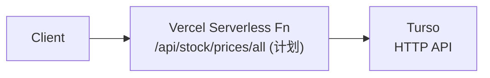
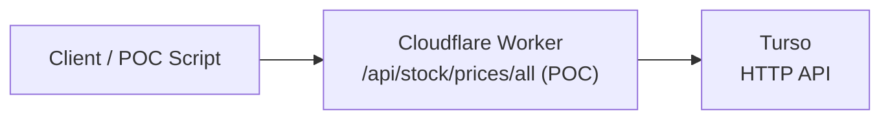

# 33. Cloudflare Workers Migration POC

**Date**: 2026-03-18  
**Status**: POC 已完成：完成 Turso 接入、正确性对比、并完成 Cloudflare vs Vercel 压测 + 迁移决策表

> **文档定位（避免与主路线图重复）**
> - 本文档是 **POC 证据文档**（实验设计、压测、成本测算、决策记录）。
> - 规模化实施顺序与范围以 [31_Capacity_Planning_And_Scaling_Strategy_20260317.md](./31_Capacity_Planning_And_Scaling_Strategy_20260317.md) 为准。
> - 当前执行原则：**先完成价格广播（broadcast），后评估 Cloudflare Workers 承载**；不将“平台迁移”作为先于“规模治理”的动作。

> 2026-03-19 生产推进状态：
> - 价格广播第一步已在 Vercel 主链路上线（`/api/stock/prices/all` + 30s 缓存 + 客户端本地过滤）。
> - 当前线上仍由 Vercel 承载广播端点；Cloudflare Workers 迁移保持“后置评估”状态（未切生产流量）。

## 1. Purpose & Scope

- **为什么要做这次 POC**
  - 验证在「价格广播架构」落地前，把部分 API 从 Vercel Serverless 迁移到 Cloudflare Workers 的**性能 / 成本 / 复杂度**收益是否真实可观。
  - 为 [31_Capacity_Planning_And_Scaling_Strategy_20260317.md](./31_Capacity_Planning_And_Scaling_Strategy_20260317.md) 中的「Tier 2 / Tier 3 Cloudflare Workers 评估」提供实测数据。
- **不在本次 POC 范围内的内容**
  - 不迁移 Next.js SSR / 静态资源，仅针对**纯 API 端点**。
  - 不改用户面向域名，不做大规模流量切换，仅在受控环境下做旁路/灰度实验。
  - 不一次性迁移所有价格/Batch 端点，只聚焦单一代表性端点。

## 2. Current State Snapshot

### 2.1 现有相关端点

- `GET /api/stock/prices`
  - 当前职责：按自选池 symbols 返回最新价格。
  - 特征：频率高、与用户规模强相关。
- （规划中）`GET /api/stock/prices/all`
  - 见 [31_Capacity_Planning_And_Scaling_Strategy_20260317.md](./31_Capacity_Planning_And_Scaling_Strategy_20260317.md) Section 5.2/5.3 的「价格广播架构」设计。
  - 预期职责：按全局股票池返回全量价格，客户端本地过滤。

### 2.2 现有基础设施

- **Runtime**: Next.js App Router on Vercel Serverless (Node.js)
- **Database**: Turso (libSQL) via HTTP (see `frontend/src/lib/db.ts`)
- **特点**
  - Vercel 计费按函数 CPU 执行时间计入 GB-hrs。
  - Cloudflare Workers 在 [31] 中被作为 Tier 3 之后的潜在迁移目标：按请求数计费、延迟优势明显，但需要迁移运行时。

### 2.3 已知动机与瓶颈（来自 31/28 等文档）

- 价格层目前仍是 **per-user polling**，在 100K+/1M 规模下 QPS/compute 急剧上升。
- [31] 提出的「价格广播架构」可以把价格查询压缩为 **O(1)**，但仍需要选择适合的执行平台。
- Vercel Pro/Enterprise 在高 GB-hrs 下的成本与 Cloudflare Workers 的（Requests）计费存在明显数量级差距，值得通过 POC 实测校准。（Workers Requests 超出免费额度后：$0.30 / million requests）

## 3. POC Goals & Success Criteria

### 3.1 明确目标

- **性能目标**
  - 在相同流量模型下，Cloudflare Workers 版本的 p95 延迟 **不劣于** 当前 Vercel Serverless 版本超过 X%（例如 |Δ| ≤ 10%），或在高并发下展现更好的尾延迟。
- **成本目标**
  - 基于 [31] 中的 1K / 10K / 100K / 1M 用户流量模型，估算 Cloudflare Workers 月度请求成本，并与 Vercel GB-hrs 模型对比，给出一个**单位用户成本折扣区间**（例如 3–10x）。
- **复杂度目标**
  - POC 期间，本地开发 / 部署 / 观测的**心智负担**可控，不显著复杂化日常工程流程。

### 3.2 成功标准与结项判定

| 维度 | 指标 | 成功标准 | POC 结论 |
|------|------|----------|-----------|
| 性能 | p95 延迟 | Cloudflare Workers 相对 Vercel 的延迟差在 ±10% 内，或在高并发场景明显优于 Vercel | 达成（见 6.1.1，压测场景下 Cloudflare 平均与 p95 更优） |
| 成本 | 月度估算 | 在 100K / 1M 模型下，Cloudflare Workers 费用显著低于 Vercel GB-hrs 估算 | 达成（见 6.2.1，价格层在价格广播假设下边际成本近似 $0） |
| 复杂度 | DX 评分 | 主 owner 对「日常开发/排障是否可接受」给出主观评分（通过/不通过） | 通过（见 10.2，总体可接受，但需保留双平台排障意识） |
| 风险 | 运行稳定性 | 在压测 + 小规模灰度期间，无系统性错误/崩溃 | 达成（压测 200/200 成功，无系统性错误） |

> 结项说明：POC 指标已形成 Go / No-go 证据；生产实施顺序与范围继续以 [31](./31_Capacity_Planning_And_Scaling_Strategy_20260317.md) 为准。

## 4. Experiment Design

### 4.1 POC 类型与范围

- **仅针对 API 层**：不调整 Next.js SSR、静态文件分发、PWA 配置。
- **仅使用 Turso 作为数据源**：Worker 通过 HTTP 访问 Turso，不引入新的 DB/KV 作为前置依赖（可在附录列出未来可能使用的 Cloudflare KV/DO）。
- **只选一个代表性端点**：以价格层为样本，不直接迁移复杂的 `/api/stock/batch` 决策端点。

### 4.2 POC 端点选择（已确认）

- **目标端点**：`GET /api/stock/prices/all`
  - 输入：无或可选 query（例如 `?market=hk`）。
  - 输出：全局股票池价格数组。
  - 对比约束：使用 `symbols` query 参数与 Vercel `/api/stock/prices` 对齐 symbol 集合，便于正确性与性能对比。

#### 4.2.1 请求/响应 Schema（示例骨架）

```ts
// Request: GET /api/stock/prices/all
// Query: ?market=hk

export type PriceBroadcastRequest = {
  market?: "hk" | "cn";
  /**
   * POC/对比用：逗号分隔的显式 symbol 列表。
   * 不传时走 broadcast 语义（global_stock_pool + stock_meta）。
   */
  symbols?: string;
  limit?: number;
};

export type PriceBroadcastItem = {
  symbol: string;
  lastPrice: number;
  change: number;
  changePct: number;
  updatedAt: string; // ISO timestamp
};

export type PriceBroadcastResponse = {
  market: string;
  asOf: string;
  items: PriceBroadcastItem[];
};
```

#### 4.2.2 Turso 数据源与表结构（当前实现）

- 广播端点当前使用的真实数据源为：
  - `daily_prices`：价格时间序列表，核心字段包括：
    - `symbol TEXT NOT NULL`
    - `date TEXT NOT NULL`
    - `change_percent REAL`
    - `close REAL`
  - `stock_meta`：元数据表，至少包含：
    - `symbol TEXT PRIMARY KEY`
    - `market TEXT NOT NULL`
  - `global_stock_pool`：全局股票池，提供「当前关注的股票集合」。
- Worker 侧抽取逻辑：
  - 先根据 `market` 从 `stock_meta` + `global_stock_pool` 选出目标股票集合。
  - 再从 `daily_prices` 中为集合里的每只股票取最新一条记录（与 `getLatestPrices` 的语义保持一致）。
  - 将 `close` 映射为 `lastPrice`，将 `change_percent` 映射为 `changePct`，并近似计算绝对涨跌额 `change ≈ close * change_percent / 100`。

### 4.3 架构对比图

#### 4.3.1 当前：Vercel Serverless



#### 4.3.2 POC：旁路 Cloudflare Workers



> POC 阶段不修改用户面向域名，仅通过「专用脚本 / 内部灰度参数」直接打 Cloudflare Worker，避免影响现有生产流量。

### 4.4 调用模式设计

- **离线对比**
  - 编写独立脚本，同时对同一批请求：
    - 发送到现有 Vercel 端点。
    - 发送到 Cloudflare Worker 端点。
  - 收集响应时间/响应体差异，用于性能与正确性对比。
- **在线灰度（可选，后置）**
  - 在前端或中间层加入内部开关（例如 `X-Stockwise-Backend: cf-workers` header 或 query 参数），仅对内部账号/实验组路由到 Cloudflare Worker。

## 5. Implementation Plan

### 5.1 Workers 项目结构（建议）

- 目录建议（单仓 + 子目录）：
  - `workers/price-broadcast/src/index.ts`
  - `workers/price-broadcast/wrangler.toml`
  - `workers/price-broadcast/package.json`
  - `workers/price-broadcast/README.md`

> 当前仓库已按上述结构创建 `workers/price-broadcast` 目录，暴露 `GET /api/stock/prices/all` 的最小 Cloudflare Worker handler，并返回静态示例数据作为第一阶段 POC。

### 5.2 Turso 访问与业务逻辑迁移

- **访问模式**
  - 使用 `fetch` 直接访问 Turso HTTP endpoint。
  - 尽量沿用现有 SQL 片段与数据映射逻辑，避免 POC 阶段产生二义性实现。
- **错误与超时策略**
  - 为 Turso 请求设定明确 timeout（例如 1–2 秒）。
  - 定义 Worker 层统一错误响应格式，便于与 Vercel 对比。

### 5.3 CI/CD 与环境配置

- **环境划分**
  - `dev`：本地 `wrangler dev`。
  - `preview`：GitHub 分支自动部署（可选）。
  - `prod-poc`：单独的 Cloudflare 环境，仅供 POC 调用。
- **配置项**
  - Turso `URL` / `AUTH_TOKEN` 通过 Workers `vars` / `secrets` 注入。
  - 若需要跨环境区分，可在 `wrangler.toml` 中为不同环境维护不同变量集合。

## 6. Measurement Methodology

### 6.1 性能测试设计

- **测试工具**
  - `workers/price-broadcast/scripts/bench.ts`（Node 脚本）
- **场景**
  - 冷启动场景：低 QPS、间歇请求，重点观察首次命中延迟。
  - 稳态场景：持续 QPS（例如 1 / 10 / 50 / 100）下的 p50/p95/p99。
- **指标**
  - 总端到端延迟（包含 Turso RTT）。
  - 如果可能，拆分 Turso 请求耗时与 Worker 自身处理时间。
  - 错误率、超时率。

#### 6.1.1 Cloudflare deployed Worker vs Vercel 压测结果（2026-03-18）

> 为了让压测可复现，Worker/Vercel 都使用同一套 `symbols=00700,03690`。
> - Cloudflare：`/api/stock/prices/all?market=hk&symbols=00700,03690`（limit 默认 200）
> - Vercel：`/api/stock/prices?symbols=00700,03690`（带 `stockwise_user_session` cookie）
> - 统一压测参数：`requests=200`、`timeoutMs=10000`。

| Provider | Endpoint | Concurrency | Success | Failure | Avg (ms) | p50 (ms) | p95 (ms) | p99 (ms) |
|------|----------|--------------|---------|---------|----------|----------|----------|----------|
| Cloudflare | `/api/stock/prices/all` | 5 | 200 | 0 | 409.5 | 280.0 | 702.6 | 3351.9 |
| Cloudflare | `/api/stock/prices/all` | 20 | 200 | 0 | 514.6 | 287.9 | 2003.5 | 3206.4 |
| Cloudflare | `/api/stock/prices/all` | 50 | 200 | 0 | 722.5 | 294.3 | 2209.4 | 3103.7 |
| Vercel | `/api/stock/prices` | 5 | 200 | 0 | 853.1 | 626.8 | 1411.6 | 3996.4 |
| Vercel | `/api/stock/prices` | 20 | 200 | 0 | 950.8 | 621.4 | 2566.4 | 3059.7 |
| Vercel | `/api/stock/prices` | 50 | 200 | 0 | 1296.3 | 858.2 | 2979.3 | 3784.5 |

### 6.2 成本估算方法

- 复用 [31] 中的流量模型（尤其是价格广播架构下的 QPS/req 数），以“价格广播端点”为主要迁移候选。
- 按 Cloudflare Workers 官方定价细则估算“月度边际成本”（明确免费额度覆盖逻辑），核心包括：
  - Requests：**100k requests/day 免费**；超出 **$0.30 / million requests**
  - CPU：免费包含 **10 ms / request**；超出 **$0.02 / million CPU ms**
- 与 Vercel GB-hrs 模型对比：
  - 使用 [31] 的 Vercel compute（含实测校准）解释为何 Hobby 很容易被价格层打爆，以及迁走价格层后 GB-hrs 压力如何显著下降。

#### 6.2.1 “从可用到空成本”的测算（面向增长准备）

在 price broadcast + edge caching（对应 [31] 的 O(1) / origin hits 降低假设）下，价格端点的“origin 真实函数调用量”会显著下降。

Cloudflare Workers 费用细节来源：[`workers.cloudflare.com/pricing`](https://workers.cloudflare.com/pricing)（Requests 免费额度与 CPU ms 计费）。

本测算使用 [31] 给出的量级作为请求数参考：price broadcast 后价格函数调用/月约 **~86K**（对比 per-user polling 的 ~50M）。

按 Cloudflare Workers 计费：

1. **请求成本（Requests）**
   - Workers 免费：100k/day ≈ 3M/月请求
   - ~86K/月远低于免费额度，因此 Requests 成本可近似为 **$0 边际成本**。

2. **CPU 成本（CPU ms）**
   - Workers 免费包含 10ms CPU/request。
   - 价格广播端点 CPU 通常主要来自少量 Turso 查询与 JSON 组装；若 CPU <= 10ms，则 CPU 成本也近似为 **$0 边际成本**。
   - 即使按更保守的 50ms CPU/request：86K * 50ms = 4.3M CPU ms
   - 超出计费：4.3M / 1M * $0.02 ≈ **$0.086/月**（仍是近乎零成本）。

3. **结论性表述（便于统筹）**
   - 当我们把价格层从 Vercel per-user polling 迁走，并让 origin hits 接近 [31] 的 ~86K/月量级时：
     - Vercel Hobby 的 GB-hrs 压力会显著下降（避免 CPU 触发计划外升级）。
     - Cloudflare Workers 的请求与 CPU 成本会被免费额度与低 CPU 执行时间“压到近乎零”，实现从可用到持续增长的“空成本”路径。

额外约束（与你们的当前顾虑对齐）：Vercel Hobby 每月仅包含 **4 CPU-hrs 的 Active CPU**（超过需要等待下一周期才可用），详见 [Vercel Hobby plan](https://vercel.com/docs/plans/hobby)。
由于 price broadcast 相比 per-user polling 将「价格端函数调用量/执行量」按 [31] 的量级下降约 **580x**（~50M 次/月 -> ~86K 次/月），因此在进入增长阶段时，价格层的 Active CPU 消耗可以被压到 Hobby 的可承载范围内，从而避免 Hobby CPU 计划外耗尽。

### 6.3 DX / 可运维性评估

- 制定一份「DX 评估问题清单」（附录补充），包括但不限于：
  - 本地联调：Next.js + Workers 同时运行时的开发体验。
  - 日志与排障：Vercel 控制台 vs Cloudflare Dashboard / `wrangler tail`。
  - 部署心智：GitHub Actions / CI pipeline 的复杂度变化。

## 6.4 Migration Decision Table（迁移优先级决策表）

> 目标：控制 CPU/计费风险的同时，把“增长时成本仍可控”的架构思路落地。

| 接口特征（判断标准） | 首选工程动作 | 为什么（贴合成本模型） | 下一步迁移到 Cloudflare Workers 的时机 |
|---|---|---|---|
| 同一份公共数据，对不同用户仅是过滤/展示差异（典型：价格层） | 先做 broadcast（如 `/api/stock/prices/all`），再上边缘缓存；客户端按自选池过滤 | 把计算从 O(users) 压到 O(1)，减少重复计算/重复函数调用，直接缓解 Vercel Hobby 的 Active CPU 预算压力 | 当 broadcast + 缓存语义稳定后，把该端点迁到 Cloudflare Workers（本 POC 验证已覆盖） |
| 同一端点里混有“公共可缓存部分”和“用户私有决策 overlay”（典型：batch/决策聚合） | 先拆分 public card（可缓存/可 ISR）与 private overlay（仍 dynamic、轻量） | 在不引入新计费形态的情况下先把“重计算”缓存化/去重，避免迁移后仍按用户线性增长消耗 CPU | 拆分后，public 部分可分别迁到 Cloudflare Workers/边缘缓存；private overlay 视延迟与调试成本决定是否迁移 |
| 每用户差异巨大、且需要强交互或强个性化推理的重计算 | 先降频、合并请求、减少 payload、提高缓存命中；尽量把重计算从线上函数中移走/异步化 | 仅“换平台”不能改变计算规模随用户增长线性扩张的问题；先做规模治理再谈迁移更省成本 | 若证明该类重计算是瓶颈，再对 Cloudflare Workers 进行 POC（但前提仍建议先拆/降频） |

## 7. Risk Assessment & Mitigation

### 7.1 技术风险

- Node.js vs Workers Runtime 差异：
  - 部分 Node-only 依赖在 Worker 中不可用。
  - Buffer/crypto 等 API 差异。
- Turso 网络拓扑：
  - Worker 所在 region 与 Turso 实例的物理距离与 RTT。

### 7.2 流量与回滚风险

- POC 阶段不直接承载用户主流量，所有调用均为：
  - 离线脚本。
  - 内部灰度（小流量、可随时关闭）。
- 若 Worker 出现系统性问题：
  - 立即关闭灰度开关。
  - 所有用户流量仍落回 Vercel Serverless 路径。

## 8. Timeline & Ownership

### 8.1 实际执行时间线（POC）

| 阶段 | 内容 | 实际状态 | 备注 |
|------|------|----------|------|
| 设计 | 完成本 POC 文档、确定端点与指标 | 已完成 | 见 Section 9 |
| Skeleton | 搭建 Workers 项目骨架，打通 Turso 请求 | 已完成 | 含本地联调 |
| 压测 | 编写压测脚本并在 dev/preview 环境跑测试 | 已完成 | 已产出性能与正确性对比 |
| 评估 | 汇总性能/成本/复杂度结论，更新本文件 | 已完成 | 已形成 Go / No-go |

### 8.2 角色与责任（POC 结项记录）

- **Owner**: Engineering（见 Section 9 决策记录）
- **Infra/DevOps 支持**: 同 Engineering 协作完成（wrangler 环境与变量注入）
- **数据分析支持**: 由工程侧基于压测脚本与流量模型完成

## 9. Decision Log

> 用于记录后续 POC 过程中的关键决策与结论，风格参考 [31_Capacity_Planning_And_Scaling_Strategy_20260317.md](./31_Capacity_Planning_And_Scaling_Strategy_20260317.md) 的 Section 8。

- **2026-03-18** — 创建 POC 设计文档骨架，确认本次 POC 聚焦「价格广播相关 API 在 Cloudflare Workers 上的可行性与收益」，不改动 SSR 和用户面向域名。
- **2026-03-18** — 修复 Worker Turso 调用：改用 `requests` 格式（非 `pipeline`）、正确解析 `cols`/`rows` 结构、支持 `libsql://` URL 转换。新增 `.dev.vars` 与 `sync-dev-vars.sh`，从 backend/.env 同步 Turso 配置。
- **2026-03-18** — Cloudflare deployed Worker vs Vercel 压测（requests=200，concurrency=5/20/50，symbols=00700,03690）
  - Cloudflare：concurrency=20 时 Avg 514.6ms，p95 2003.5ms，p99 3206.4ms（Success 200 / Failure 0）
  - Vercel：concurrency=20 时 Avg 950.8ms，p95 2566.4ms，p99 3059.7ms（Success 200 / Failure 0）
- **2026-03-18** — 正确性对比（Vercel `/api/stock/prices` vs Worker `/api/stock/prices/all`）
  - Symbols: `00700, 03690`
  - 用 `symbols` query 参数确保与 Vercel 请求的 symbol 集合一致
  - 对 `close` 与 `change_percent` 的相对误差在容忍阈值内：两只标的均 `OK`
- **2026-03-18** — 对比脚本支持 session cookie：从 `backend/.env`、`frontend/.env` 加载 `USER_SESSION_SECRET`，通过 `COMPARE_USER_ID` 或 Turso 查询获取 `user_id`，生成 `stockwise_user_session` cookie 后请求 Vercel `/api/stock/prices`。需在 frontend/.env 中配置 `USER_SESSION_SECRET` 方可完成 Vercel vs Worker 数据一致性对比。
- **2026-03-18** — 成本结论：在采用 price broadcast + edge caching（对应 [31] 的 origin hits 降低假设）后，价格端点 origin 调用量可降到 ~86K/月量级；Cloudflare Workers 具备 100k requests/day 免费额度与 10ms CPU/request 免费包含，因此请求与 CPU 边际成本可近似为 **$0**（“从可用到空成本”），同时显著缓解 Vercel Hobby 价格层导致的 GB-hrs 超配风险。
- **2026-03-18** — POC 结项（Go / No-go）：
  - **Go**：价格层优先做 broadcast（`/api/stock/prices/all`）并先在现有生产链路稳定运行，作为控制 Vercel Hobby Active CPU 风险的主路径；待 broadcast 语义与指标稳定后，再评估该公共端点的 Cloudflare 承载切换。
  - **No-go（POC 结项范围内）**：不推荐直接“迁移高 CPU 的 monolith API”作为首选方案；先依据 `6.4 Migration Decision Table` 完成 public/private 拆分与缓存化，再决定迁移范围。
- **2026-03-19** — Broadcast Phase-1 在 Vercel 生产链路上线：
  - 新增 `GET /api/stock/prices/all`（支持 `market=all|hk|cn`）。
  - 广播缓存策略：`Cache-Control: public, s-maxage=30, stale-while-revalidate=30`；服务端查询层 `revalidate: 30`。
  - 前端价格刷新主路径切换到广播端点，盘中刷新 30 秒，非交易时段 10 分钟。
  - 生产容错：广播连续失败触发熔断，自动回退 legacy `/api/stock/prices`，冷却后自动恢复探测。
- **2026-03-19** — `global_stock_pool` 一致性修复与线上清理完成：
  - 修复 `stock-pool` add/delete 的计数幂等问题，并在 `watchers_count <= 0` 时移除 symbol。
  - 线上对账清理结果：清理后 `watchers_count<=0=0`，计数不一致 `0`（对齐 `user_watchlist` 实际人数）。

## 10. Appendix

### 10.1 参考文档

- [31_Capacity_Planning_And_Scaling_Strategy_20260317.md](./31_Capacity_Planning_And_Scaling_Strategy_20260317.md)
- [28_Price_Sync_Zero_Stale_Protocol_20260316.md](./28_Price_Sync_Zero_Stale_Protocol_20260316.md)
- [32_Frontend_Network_Optimization_Zero_Redundancy.md](./32_Frontend_Network_Optimization_Zero_Redundancy.md)

### 10.2 DX 评估结论（POC 阶段）

- 本地开发：可接受。需要并行使用 Next.js 与 Worker 的调试命令，但流程可控。
- 日志与排障：可接受。需要在 Vercel 与 Cloudflare 两侧同时观察日志（如 `wrangler tail`）。
- 部署与回滚：可接受。POC 为旁路调用，不影响既有 Vercel 主路径；回滚策略为关闭灰度开关。
- 运营约束：若进入生产灰度，需补齐统一监控与告警口径，避免双平台观测割裂。

