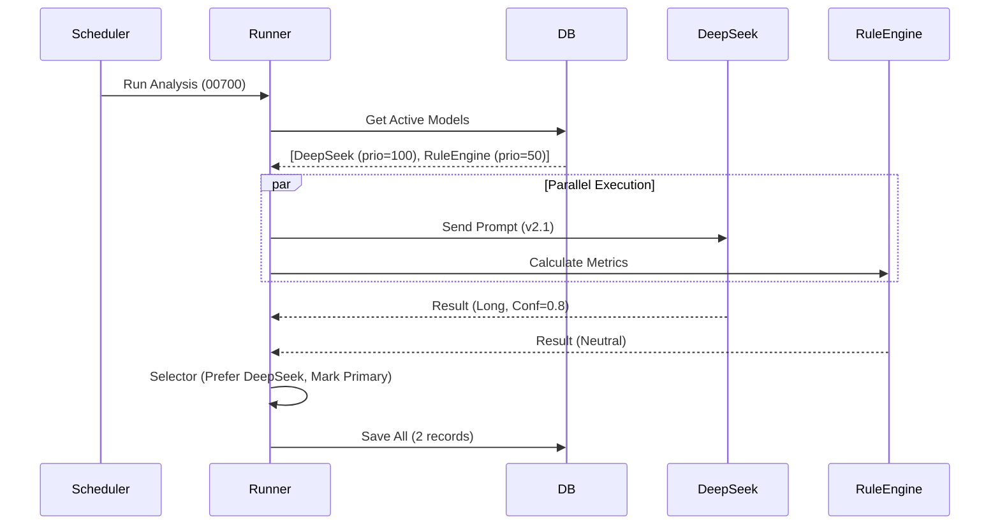

# StockWise 多模型 AI 预测架构设计 (v2.0)

> **目标**: 打破当前 “一票一模型” 的限制，支持多模型竞技（Rule vs LLM）、环境自适应（Local vs Cloud）及 A/B 测试。
> **状态**: Design Freeze / Ready for Implementation

## 1. 核心痛点与价值

| 当前痛点 (AS-IS)                                                   | 升级价值 (TO-BE)                                                             |
| :----------------------------------------------------------------- | :--------------------------------------------------------------------------- |
| **单点依赖**: 仅支持一个 AI 结果，覆盖规则引擎结果，无法横向对比。 | **赛马机制**: 同一股票可由 DeepSeek V3、Gemini、规则引擎同时预测，择优展示。 |
| **环境僵化**: 开发环境不敢跑 AI (费钱)，生产环境无法跑本地模型。   | **环境自适应**: 开发环境自动切 `local-mock`，生产环境切 `deepseek-cloud`。   |
| **黑盒优化**: 无法量化 Prompt 的改进效果。                         | **A/B 测试**: 支持 `prompt_version` 追踪，通过胜率数据驱动 Prompt 迭代。     |
| **盲目信任**: 缺乏 Token 消耗和耗时监控。                          | **可观测性**: 记录 Token Usage 和 Latency，评估模型性价比。                  |

---

## 2. 数据库设计 (Schema Evolution)

### 2.1 新增：模型注册表 (`prediction_models`)
管理所有可用的预测引擎及其配置。

```sql
CREATE TABLE prediction_models (
    model_id TEXT PRIMARY KEY,       -- E.g., 'deepseek-v3', 'rule-engine', 'gemini-flash'
    display_name TEXT NOT NULL,      -- UI Title: "DeepSeek V3 (Cloud)"
    provider TEXT NOT NULL,          -- Type: 'adapter-openai', 'adapter-google', 'rule-engine', 'mock'
    
    is_active BOOLEAN DEFAULT 1,     -- Enable/Disable globally
    priority INTEGER DEFAULT 0,      -- Selection priority (Higher = Preferred Primary)
    
    -- Configuration & Capabilities
    config_json TEXT,                -- JSON: { "api_base": "...", "model_name": "...", "max_tokens": 4096 }
    capabilities_json TEXT,          -- JSON: { "vision": false, "json_mode": true, "cost_tier": "low" }
    
    created_at TIMESTAMP DEFAULT CURRENT_TIMESTAMP
);

-- Seed Data Example
-- INSERT INTO prediction_models ... VALUES ('deepseek-v3', 'DeepSeek V3', 'adapter-openai', 100, ...);
```

### 2.2 升级：预测结果表 (`ai_predictions`)
**核心变更**: 
1. 主键升级为 `(symbol, date, model_id)`。
2. 增加 `prompt_version` 和 `token_usage` 以支持 A/B 测试和成本分析。

```sql
CREATE TABLE ai_predictions_v2 (
    -- Composite Key
    symbol TEXT NOT NULL,
    date TEXT NOT NULL,              -- Analysis date (YYYY-MM-DD)
    model_id TEXT NOT NULL,          -- 🔑 FK to prediction_models
    
    -- Payload
    target_date TEXT NOT NULL,       -- Valid for date
    signal TEXT,                     -- Enum: Long, Side, Short
    confidence REAL,                 -- 0.0 - 1.0 (Normalized)
    support_price REAL,
    pressure_price REAL,
    
    -- Content
    ai_reasoning TEXT,               -- Main analysis text (Markdown/JSON)
    
    -- Metadata & Observability
    prompt_version TEXT,             -- E.g., "v2.1-conservative" or Hash
    token_usage_input INTEGER,       
    token_usage_output INTEGER,
    execution_time_ms INTEGER,       -- Performance tracking
    
    -- Validation & Selection
    validation_status TEXT DEFAULT 'Pending', -- Pending, Correct, Incorrect, Invalid
    actual_change REAL,
    is_primary BOOLEAN DEFAULT 0,    -- 🌟 The "Winner" record for default display
    
    created_at TIMESTAMP DEFAULT CURRENT_TIMESTAMP,
    updated_at TIMESTAMP DEFAULT CURRENT_TIMESTAMP,
    
    PRIMARY KEY (symbol, date, model_id),
    FOREIGN KEY (model_id) REFERENCES prediction_models(model_id)
);
```

---

## 3. 后端架构详细设计

### 3.1 核心组件

#### `ModelFactory` (Factory Pattern)
负责根据 `model_id` 和 `provider` 实例化对应的适配器。
- `OpenAIAdapter`: 标准 OpenAI 兼容接口 (DeepSeek, ChatGPT)。支持 `config_json` 中的 `api_key` (env var name) 和 `base_url`。
- `RuleAdapter`: 本地 Python 逻辑，复用现有的 Technical Indicator 计算。
- `MockAdapter`: 固定返回 JSON，用于开发和 CI/CD。

#### `PredictionRunner` (Orchestrator)
负责调度预测任务，位于 `backend/analysis/runner.py`。
- **并发模式 (Race Mode)**: 使用 `asyncio.gather` 并行请求所有 active models。
- **熔断机制**: 设置超时 (e.g. 30s)，单一模型失败不影响整体。
- **选优逻辑 (Selector)**:
    1. 收集所有成功结果。
    2. 对比 `Rules` 结果：如果 `DeepSeek` 看多但 `Rules` 极度看空，记录 Warning。
    3. 默认选 `priority` 最高且 `confidence > threshold` 的结果标记为 `is_primary=1`。

#### `PromptManager` (Versioning)
- 将 Prompt 模板存储在代码库 `backend/prompts/` 目录下。
- 文件命名规范: `system_prompt_v{version}.txt`。
- 运行时读取 Prompt 文件，并将其版本号 (`v2.1`) 存入 `ai_predictions.prompt_version`。

### 3.2 流程 (Sequence)



---

## 4. API 接口规范

### `GET /api/stocks/{symbol}/prediction`
返回当日的预测结果。

**Query Params:**
- `date`: Optional, 默认今日。
- `mode`: `simple` (default, only primary) | `full` (all models).

**Response (mode=full):**

```json
{
  "symbol": "00700",
  "date": "2026-01-04",
  "primary_prediction": {
    "model_id": "deepseek-v3",
    "signal": "Long",
    "confidence": 0.85,
    "reasoning": "...",
    "prompt_version": "v2.1"
  },
  "alternatives": [
    {
      "model_id": "rule-engine",
      "signal": "Side",
      "confidence": 0.60,
      "reasoning": "MA20 阻力位未突破"
    }
  ],
  "consensus": "Diverged" 
}
```

---

## 5. 前端交互设计

### 5.1 详情页 (Stock Detail)
- **主卡片**: 保持现状，展示 `primary_prediction` 的内容。
- **"AI 委员会" (AI Council) 组件**:
    - 在主观点下方增加一个折叠区域。
    - 列出其他模型（如纯技术面规则）的观点。
    - **一致性标签**: 
        - ✅ **共振**: 所有 active 模型方向一致。
        - ⚠️ **分歧**: AI 看多但技术面看空（提示风险）。

---

## 6. 迁移计划 (Detailed Roadmap)

### Phase 1: 基础建设 (Infrastructure)
1. **Schema Migration**:
   - `mv ai_predictions ai_predictions_legacy`
   - Create `prediction_models` & seed data.
   - Create `ai_predictions` (v2).
   - `INSERT INTO ai_predictions ... SELECT ... FROM ai_predictions_legacy`.
2. **Backend Base**:
   - Create `backend/engine/models/` and `backend/engine/runner.py`.

### Phase 2: 并行运行 (Shadow Mode)
1. 保持旧逻辑 `run_analysis` 不变，新增 `run_multi_model_analysis` 任务。
2. 让新流程写入数据，但不用于前端展示 (is_primary=0)。
3. 验证数据完整性和 token logging。

### Phase 3: 切流 (Switch Over)
1. 修改 API 读取 v2 表。
2. 前端增加 "模型对比" 组件。

### Phase 4: 移除旧代码
1. 删除旧的 `gemini_client.py` 强耦合逻辑。
