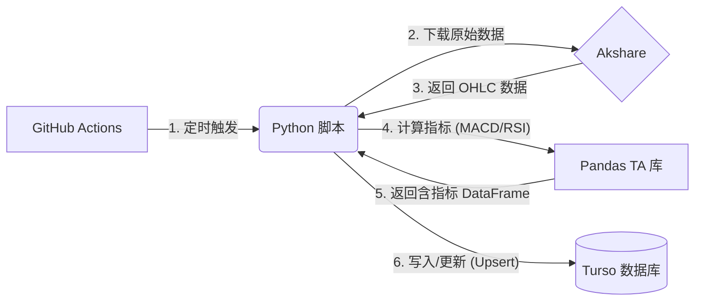

# StockWise 后台数据技术方案 v2.0

> **带指标计算的 Serverless 量化数据流**

## 📋 概述

本方案的核心升级在于引入 **"本地计算层"**，使系统不再仅仅是数据搬运工具，而是具备**数据加工能力**。数据库存储的是"清洗并计算好的特征数据"，可直接用于后续的 AI 分析或回测。

---

## 🏗️ 架构设计

### 数据流架构图



### 核心组件

| 组件 | 选型 | 作用 |
|------|------|------|
| **调度器** | GitHub Actions | 定时触发数据同步任务 |
| **数据源** | Akshare | 提供 A 股基础行情数据 |
| **计算引擎** | Pandas TA | 纯 Python 技术指标计算库 |
| **数据库** | Turso (libSQL) | 存储日线 + 技术指标 |

---

## 📦 依赖配置

### requirements.txt

```text
akshare
pandas
libsql-experimental
pandas_ta
```

---

## 🗄️ 数据库设计

### 表结构：daily_prices

```sql
CREATE TABLE daily_prices (
    symbol TEXT,           -- 股票代码
    date TEXT,             -- 交易日期
    open REAL,             -- 开盘价
    close REAL,            -- 收盘价
    high REAL,             -- 最高价
    low REAL,              -- 最低价
    volume REAL,           -- 成交量
    -- 技术指标
    macd REAL,             -- MACD 线
    macd_signal REAL,      -- 信号线
    macd_hist REAL,        -- MACD 柱状图
    rsi REAL,              -- RSI (14日)
    PRIMARY KEY (symbol, date)
);
```

---

## 💻 核心代码

### main.py

```python
import os
import akshare as ak
import pandas as pd
import pandas_ta as ta
import libsql_experimental as libsql

# --- 配置 ---
TARGET_STOCKS = ["600000", "000001", "600519"]

# --- 数据库连接 ---
url = os.environ.get("TURSO_DB_URL")
auth_token = os.environ.get("TURSO_AUTH_TOKEN")
conn = libsql.connect(database=url, auth_token=auth_token)
cursor = conn.cursor()


def init_db():
    """初始化数据库表结构"""
    cursor.execute("""
        CREATE TABLE IF NOT EXISTS daily_prices (
            symbol TEXT, date TEXT,
            open REAL, close REAL, high REAL, low REAL, volume REAL,
            macd REAL, macd_signal REAL, macd_hist REAL, rsi REAL,
            PRIMARY KEY (symbol, date)
        );
    """)
    conn.commit()


def process_stock(symbol: str):
    """处理单支股票：下载 -> 计算指标 -> 入库"""
    print(f"🚀 开始处理: {symbol}")

    # 1. 获取数据
    try:
        df = ak.stock_zh_a_hist(
            symbol=symbol, period="daily",
            start_date="20240101", adjust="qfq"
        )
        if df.empty:
            print(f"⚠️ {symbol} 无数据")
            return
    except Exception as e:
        print(f"❌ {symbol} 下载失败: {e}")
        return

    # 2. 数据清洗 (重命名为英文)
    df = df.rename(columns={
        "日期": "date", "开盘": "open", "收盘": "close",
        "最高": "high", "最低": "low", "成交量": "volume"
    })

    # 3. 计算技术指标
    df.ta.macd(close='close', fast=12, slow=26, signal=9, append=True)
    df.ta.rsi(close='close', length=14, append=True)

    # 4. 整理列名
    df = df.rename(columns={
        "MACD_12_26_9": "macd",
        "MACDs_12_26_9": "macd_signal",
        "MACDh_12_26_9": "macd_hist",
        "RSI_14": "rsi"
    })

    # 5. 最终清洗
    df['date'] = df['date'].astype(str)
    df = df.fillna(0)

    # 6. 批量写入数据库
    records = [
        (symbol, row['date'], row['open'], row['close'],
         row['high'], row['low'], row['volume'],
         row['macd'], row['macd_signal'], row['macd_hist'], row['rsi'])
        for _, row in df.iterrows()
    ]

    try:
        cursor.execute_batch("""
            INSERT OR REPLACE INTO daily_prices
            (symbol, date, open, close, high, low, volume,
             macd, macd_signal, macd_hist, rsi)
            VALUES (?, ?, ?, ?, ?, ?, ?, ?, ?, ?, ?)
        """, records)
        conn.commit()
        print(f"✅ {symbol} 同步完成，更新 {len(records)} 条记录")
    except Exception as e:
        print(f"❌ {symbol} 写入失败: {e}")


if __name__ == "__main__":
    init_db()
    for stock in TARGET_STOCKS:
        process_stock(stock)
```

---

## ✨ 方案亮点

| 特性 | 说明 |
|------|------|
| **解耦设计** | 数据获取 (Akshare) 与数据计算 (Pandas TA) 分离，便于独立维护升级 |
| **高性能写入** | 使用 `execute_batch` + `INSERT OR REPLACE`，批量 Upsert |
| **零维护成本** | GitHub Actions 无服务器架构，无需担心服务器维护 |
| **可扩展性** | 轻松添加更多技术指标或数据源 |

---

## 🔮 后续优化方向

### 增量更新策略

当前方案为全量同步，随着数据量增长，可优化为增量更新：

1. **查询最新日期**：运行前查询数据库中该股票的最新日期
2. **增量下载**：只下载最新日期之后的数据
3. **降低负载**：减少网络请求量，规避反爬风控

```python
# 示例：查询最新日期
cursor.execute(
    "SELECT MAX(date) FROM daily_prices WHERE symbol = ?",
    (symbol,)
)
latest_date = cursor.fetchone()[0]
```

---

## 📚 相关文档

- [Akshare 官方文档](https://akshare.akfamily.xyz/)
- [Pandas TA 文档](https://github.com/twopirllc/pandas-ta)
- [Turso 文档](https://docs.turso.tech/)

---

*文档版本: v2.0 | 更新日期: 2024-12-22*
